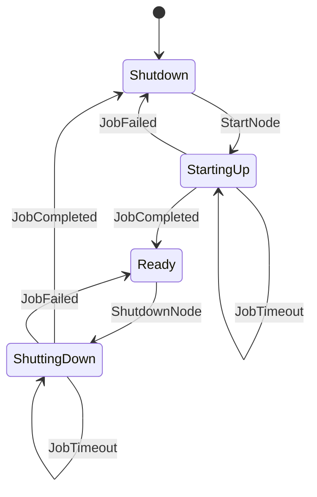
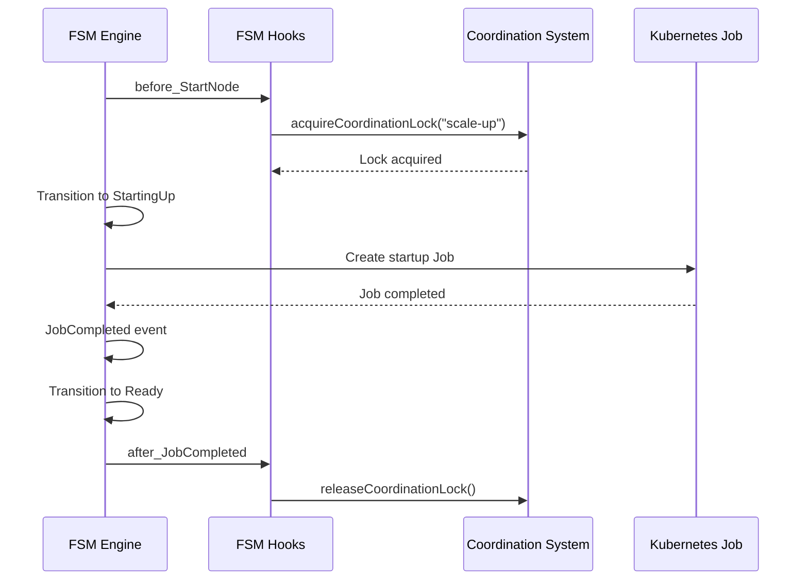

# Finite State Machine (FSM) Architecture for Homelab-Autoscaler

## Table of Contents

1. [Overview](#overview)
2. [Current State Management Analysis](#current-state-management-analysis)
3. [Proposed FSM Architecture](#proposed-fsm-architecture)
4. [FSM States and Transitions](#fsm-states-and-transitions)
5. [Integration with Coordination Locks](#integration-with-coordination-locks)
6. [Async Architecture with Kubernetes Jobs](#async-architecture-with-kubernetes-jobs)
7. [Smart Backoff and Timeout Handling](#smart-backoff-and-timeout-handling)
8. [Error Handling Strategies](#error-handling-strategies)
9. [Implementation Requirements](#implementation-requirements)
10. [Benefits Over Current Approach](#benefits-over-current-approach)
11. [Technical Implementation Plan](#technical-implementation-plan)
12. [Code Examples](#code-examples)

## Overview

This document proposes a comprehensive Finite State Machine (FSM) architecture for the homelab-autoscaler project using the [looplab/fsm](https://github.com/looplab/fsm) library. The FSM will formalize state transitions for Node power management while integrating seamlessly with the existing coordination annotation system and async Kubernetes Job architecture.

### Key Design Principles

- **Formal State Management**: Replace ad-hoc state transitions with a well-defined FSM
- **Coordination Integration**: Use looplab/fsm hooks to manage coordination annotations
- **Async Job Support**: Integrate with existing Kubernetes Job-based power operations
- **Smart Backoff**: Implement state-aware timeout and retry strategies
- **Error Recovery**: Provide clear error states and recovery mechanisms

## Current State Management Analysis

The current implementation uses a coordination annotation system with the following components:

### Coordination Annotation Keys

The system uses four specific annotation keys for inter-controller coordination:

```go
const (
    OperationLockAnnotation = "homelab-autoscaler.dev/operation-lock"
    LockOwnerAnnotation     = "homelab-autoscaler.dev/lock-owner"
    LockTimestampAnnotation = "homelab-autoscaler.dev/lock-timestamp"
    LockTimeoutAnnotation   = "homelab-autoscaler.dev/lock-timeout"
)
```

### Current Progress States

The system defines four progress states in [`api/infra/v1alpha1/node_types.go`](api/infra/v1alpha1/node_types.go:79-86):

```go
type Progress string

const (
    ProgressShuttingDown Progress = "shuttingdown"
    ProgressShutdown     Progress = "shutdown"
    ProgressStartingUp   Progress = "startingup"
    ProgressReady        Progress = "ready"
)
```

### Operation Types

The coordination system uses two operation types:
- `"scale-up"`: Node startup operations
- `"scale-down"`: Node shutdown operations

### Async Architecture

State transitions are handled asynchronously using:
- [`startNodeAsync()`](internal/controller/infra/node_controller.go:545) goroutines
- [`shutdownNodeAsync()`](internal/controller/infra/node_controller.go:579) goroutines
- Kubernetes Jobs for actual power operations
- 5-minute timeout for job completion

### Smart Backoff Strategy

The current system implements a 4-tier backoff strategy in [`validateStateTransition()`](internal/controller/infra/node_controller.go:686):

1. **Early Phase (0-2 min)**: 30-second backoff
2. **Normal Phase (2-10 min)**: 2-minute backoff  
3. **Late Phase (10-15 min)**: 5-minute backoff
4. **Stuck Phase (>15 min)**: Force cleanup and retry

## Proposed FSM Architecture

### FSM Library Choice

We will use the [looplab/fsm](https://github.com/looplab/fsm) library for the following reasons:

- **Hook Support**: Provides `before_` and `after_` hooks for state transitions
- **Event-Driven**: Clean event-based state transitions
- **Go Native**: Well-maintained Go library with good performance
- **Flexible**: Supports complex state machines with callbacks

### FSM Design Overview



## FSM States and Transitions

### State Definitions

The FSM states map directly to the existing Progress enum values:

| FSM State | Progress Enum | Description |
|-----------|---------------|-------------|
| `Shutdown` | `ProgressShutdown` | Node is powered off and ready for startup |
| `StartingUp` | `ProgressStartingUp` | Node startup operation in progress |
| `Ready` | `ProgressReady` | Node is powered on and operational |
| `ShuttingDown` | `ProgressShuttingDown` | Node shutdown operation in progress |

### Event Definitions

| Event | Description | Valid From States |
|-------|-------------|-------------------|
| `StartNode` | Initiate node startup | `Shutdown` |
| `ShutdownNode` | Initiate node shutdown | `Ready` |
| `JobCompleted` | Async job completed successfully | `StartingUp`, `ShuttingDown` |
| `JobFailed` | Async job failed | `StartingUp`, `ShuttingDown` |
| `JobTimeout` | Job exceeded timeout, retry | `StartingUp`, `ShuttingDown` |
| `ForceCleanup` | Force state reset after stuck transition | Any |

### State Transition Matrix

```go
var transitions = []fsm.EventDesc{
    {Name: "StartNode", Src: []string{"Shutdown"}, Dst: "StartingUp"},
    {Name: "ShutdownNode", Src: []string{"Ready"}, Dst: "ShuttingDown"},
    {Name: "JobCompleted", Src: []string{"StartingUp"}, Dst: "Ready"},
    {Name: "JobCompleted", Src: []string{"ShuttingDown"}, Dst: "Shutdown"},
    {Name: "JobFailed", Src: []string{"StartingUp"}, Dst: "Shutdown"},
    {Name: "JobFailed", Src: []string{"ShuttingDown"}, Dst: "Ready"},
    {Name: "JobTimeout", Src: []string{"StartingUp", "ShuttingDown"}, Dst: "StartingUp"},
    {Name: "ForceCleanup", Src: []string{"StartingUp", "ShuttingDown"}, Dst: "Shutdown"},
}
```

## Integration with Coordination Locks

### Hook-Based Coordination

The FSM will integrate with the existing coordination annotation system using looplab/fsm hooks:

#### Before Hooks (Lock Acquisition)

```go
// Before starting any transition, acquire coordination lock
func (nm *NodeStateMachine) beforeTransition(event string, src, dst string) {
    switch event {
    case "StartNode":
        nm.acquireCoordinationLock("scale-up", DefaultLockTimeout)
    case "ShutdownNode":
        nm.acquireCoordinationLock("scale-down", DefaultLockTimeout)
    }
}
```

#### After Hooks (Lock Release)

```go
// After completing transitions, release coordination lock
func (nm *NodeStateMachine) afterTransition(event string, src, dst string) {
    switch dst {
    case "Ready", "Shutdown":
        nm.releaseCoordinationLock()
    }
}
```

### Lock Lifecycle Management



## Async Architecture with Kubernetes Jobs

### Job Integration Pattern

The FSM will integrate with the existing async Job architecture:

```go
type NodeStateMachine struct {
    fsm    *fsm.FSM
    node   *infrav1alpha1.Node
    client client.Client
    
    // Job tracking
    currentJob     string
    jobTimeout     time.Duration
    jobStartTime   time.Time
}

func (nm *NodeStateMachine) startNodeTransition() error {
    // FSM handles state transition
    err := nm.fsm.Event("StartNode")
    if err != nil {
        return err
    }
    
    // Create Kubernetes Job (existing logic)
    job := nm.createStartupJob()
    if err := nm.client.Create(context.TODO(), job); err != nil {
        nm.fsm.Event("JobFailed")
        return err
    }
    
    // Start async monitoring
    go nm.monitorJob(job.Name, "JobCompleted", "JobFailed")
    
    return nil
}
```

### Async Job Monitoring

```go
func (nm *NodeStateMachine) monitorJob(jobName, successEvent, failEvent string) {
    defer func() {
        // Always attempt to release lock on completion
        nm.fsm.Event(successEvent) // This will trigger after_ hook
    }()
    
    // Wait for job completion with timeout
    if err := nm.waitForJobCompletion(jobName, nm.jobTimeout); err != nil {
        if errors.Is(err, context.DeadlineExceeded) {
            nm.fsm.Event("JobTimeout")
        } else {
            nm.fsm.Event(failEvent)
        }
        return
    }
    
    // Job completed successfully
    nm.fsm.Event(successEvent)
}
```

## Smart Backoff and Timeout Handling

### State-Aware Backoff Strategy

The FSM will implement an enhanced backoff strategy that considers both time and state:

```go
type BackoffStrategy struct {
    transitionStart time.Time
    retryCount      int
    maxRetries      int
}

func (nm *NodeStateMachine) calculateBackoff() time.Duration {
    elapsed := time.Since(nm.backoff.transitionStart)
    
    switch {
    case elapsed <= 2*time.Minute:
        return 30 * time.Second  // Early phase
    case elapsed <= 10*time.Minute:
        return 2 * time.Minute   // Normal phase
    case elapsed <= 15*time.Minute:
        return 5 * time.Minute   // Late phase
    default:
        // Force cleanup after 15 minutes
        nm.fsm.Event("ForceCleanup")
        return 0
    }
}
```

### Timeout Handling Matrix

| State | Timeout Threshold | Action |
|-------|------------------|--------|
| `StartingUp` | 5 minutes | Retry job, increment backoff |
| `StartingUp` | 15 minutes | Force cleanup to `Shutdown` |
| `ShuttingDown` | 5 minutes | Retry job, increment backoff |
| `ShuttingDown` | 15 minutes | Force cleanup to `Shutdown` |

## Error Handling Strategies

### Error State Management

The FSM provides clear error handling through events and state transitions:

#### Job Failure Handling

```go
func (nm *NodeStateMachine) handleJobFailure(jobName string, err error) {
    logger := log.Log.WithName("fsm")
    
    // Update node status with error condition
    nm.updateNodeCondition(metav1.Condition{
        Type:    "JobFailed",
        Status:  metav1.ConditionTrue,
        Reason:  "AsyncJobFailed",
        Message: fmt.Sprintf("Job %s failed: %v", jobName, err),
    })
    
    // Trigger FSM event based on current state
    switch nm.fsm.Current() {
    case "StartingUp":
        nm.fsm.Event("JobFailed") // Transitions back to Shutdown
    case "ShuttingDown":
        nm.fsm.Event("JobFailed") // Transitions back to Ready
    }
}
```

#### Coordination Lock Conflicts

```go
func (nm *NodeStateMachine) handleLockConflict(operation string, owner string) error {
    logger := log.Log.WithName("fsm")
    
    logger.Info("Coordination lock conflict detected",
        "node", nm.node.Name,
        "operation", operation,
        "owner", owner)
    
    // FSM prevents invalid transitions automatically
    // Return error to trigger controller requeue
    return fmt.Errorf("coordination lock conflict: %s owned by %s", operation, owner)
}
```

### Recovery Mechanisms

#### Stuck State Recovery

```go
func (nm *NodeStateMachine) checkStuckState() {
    if nm.isTransitionStuck() {
        logger := log.Log.WithName("fsm")
        logger.Info("Detected stuck state transition, forcing cleanup",
            "node", nm.node.Name,
            "state", nm.fsm.Current(),
            "duration", time.Since(nm.backoff.transitionStart))
        
        // Force cleanup and reset to known good state
        nm.fsm.Event("ForceCleanup")
    }
}
```

## Implementation Requirements

### Core Components

#### 1. NodeStateMachine Struct

```go
type NodeStateMachine struct {
    // FSM engine
    fsm *fsm.FSM
    
    // Kubernetes resources
    node   *infrav1alpha1.Node
    client client.Client
    scheme *runtime.Scheme
    
    // Coordination management
    coordinationManager *CoordinationManager
    
    // Job tracking
    currentJob   string
    jobTimeout   time.Duration
    jobStartTime time.Time
    
    // Backoff strategy
    backoff *BackoffStrategy
    
    // Callbacks
    callbacks *FSMCallbacks
}
```

#### 2. FSM Callbacks Interface

```go
type FSMCallbacks struct {
    // Job management
    CreateStartupJob  func(*infrav1alpha1.Node) (*batchv1.Job, error)
    CreateShutdownJob func(*infrav1alpha1.Node) (*batchv1.Job, error)
    
    // Status updates
    UpdateNodeStatus func(*infrav1alpha1.Node, string, metav1.Condition) error
    
    // Coordination
    AcquireLock func(string, time.Duration) error
    ReleaseLock func() error
    
    // Kubernetes operations
    UpdateKubernetesNode func(*corev1.Node) error
}
```

#### 3. Factory Function

```go
func NewNodeStateMachine(
    node *infrav1alpha1.Node,
    client client.Client,
    callbacks *FSMCallbacks,
) *NodeStateMachine {
    
    nm := &NodeStateMachine{
        node:      node,
        client:    client,
        callbacks: callbacks,
        jobTimeout: 5 * time.Minute,
        backoff:   &BackoffStrategy{maxRetries: 3},
    }
    
    // Initialize FSM with transitions and hooks
    nm.fsm = fsm.NewFSM(
        nm.getCurrentState(),
        transitions,
        fsm.Callbacks{
            "before_StartNode":    nm.beforeStartNode,
            "before_ShutdownNode": nm.beforeShutdownNode,
            "after_JobCompleted":  nm.afterJobCompleted,
            "after_JobFailed":     nm.afterJobFailed,
        },
    )
    
    return nm
}
```

### Integration Points

#### 1. Controller Integration

```go
func (r *NodeReconciler) Reconcile(ctx context.Context, req ctrl.Request) (ctrl.Result, error) {
    // Get Node CR
    node := &infrav1alpha1.Node{}
    if err := r.Get(ctx, req.NamespacedName, node); err != nil {
        return ctrl.Result{}, client.IgnoreNotFound(err)
    }
    
    // Create FSM instance
    fsm := NewNodeStateMachine(node, r.Client, r.createCallbacks())
    
    // Process desired state changes
    if node.Spec.DesiredPowerState == infrav1alpha1.PowerStateOn {
        if err := fsm.StartNode(); err != nil {
            return ctrl.Result{RequeueAfter: fsm.calculateBackoff()}, err
        }
    } else if node.Spec.DesiredPowerState == infrav1alpha1.PowerStateOff {
        if err := fsm.ShutdownNode(); err != nil {
            return ctrl.Result{RequeueAfter: fsm.calculateBackoff()}, err
        }
    }
    
    return ctrl.Result{}, nil
}
```

#### 2. gRPC Server Integration

```go
func (s *HomeClusterProviderServer) NodeGroupIncreaseSize(
    ctx context.Context, 
    req *pb.NodeGroupIncreaseSizeRequest,
) (*pb.NodeGroupIncreaseSizeResponse, error) {
    
    // Find powered off node
    node, err := s.findPoweredOffNode(ctx, req.Id)
    if err != nil {
        return nil, status.Errorf(codes.FailedPrecondition, "no powered off nodes found: %v", err)
    }
    
    // Create FSM and trigger startup
    fsm := NewNodeStateMachine(node, s.Client, s.createCallbacks())
    if err := fsm.StartNode(); err != nil {
        return nil, status.Errorf(codes.Internal, "failed to start node: %v", err)
    }
    
    return &pb.NodeGroupIncreaseSizeResponse{}, nil
}
```

## Benefits Over Current Approach

### 1. Formal State Management

| Current Approach | FSM Approach |
|------------------|--------------|
| Ad-hoc state transitions | Formal state machine with defined transitions |
| Manual state validation | Automatic invalid transition prevention |
| Scattered state logic | Centralized state management |

### 2. Improved Error Handling

| Current Approach | FSM Approach |
|------------------|--------------|
| Error handling in multiple places | Centralized error state management |
| Inconsistent error recovery | Formal error recovery transitions |
| Manual cleanup logic | Automatic cleanup through FSM events |

### 3. Better Coordination

| Current Approach | FSM Approach |
|------------------|--------------|
| Manual lock management | Hook-based automatic lock management |
| Lock acquisition scattered | Centralized lock lifecycle |
| Race condition prone | FSM prevents invalid concurrent transitions |

### 4. Enhanced Observability

| Current Approach | FSM Approach |
|------------------|--------------|
| Limited state visibility | Clear current state and valid transitions |
| Manual state logging | Automatic state transition logging |
| Difficult debugging | FSM state history and transition tracking |

## Technical Implementation Plan

### Phase 1: Core FSM Implementation

1. **Add looplab/fsm dependency**
   ```bash
   go get github.com/looplab/fsm
   ```

2. **Create FSM package structure**
   ```
   internal/fsm/
   ├── node_state_machine.go
   ├── callbacks.go
   ├── coordination.go
   └── backoff.go
   ```

3. **Implement NodeStateMachine**
   - Core FSM setup with states and transitions
   - Hook integration for coordination annotations
   - Job monitoring and async handling

### Phase 2: Controller Integration

1. **Update NodeReconciler**
   - Replace direct state management with FSM
   - Integrate FSM into reconciliation loop

2. **Update gRPC Server**
   - Replace direct Node CR updates with FSM events
   - Integrate with NodeGroupIncreaseSize and NodeGroupDeleteNodes

### Phase 3: Enhanced Features

1. **Advanced Backoff**
   - Implement state-aware backoff strategies
   - Add retry limits and exponential backoff

2. **Observability**
   - Add FSM state metrics
   - Implement state transition logging
   - Create debugging tools

### Phase 4: Testing and Validation

1. **Unit Tests**
   - FSM state transition tests
   - Hook integration tests
   - Error scenario tests

2. **Integration Tests**
   - Controller integration tests
   - gRPC server integration tests
   - Coordination conflict tests

## Code Examples

### Basic FSM Setup

```go
package fsm

import (
    "context"
    "fmt"
    "time"
    
    "github.com/looplab/fsm"
    infrav1alpha1 "github.com/homecluster-dev/homelab-autoscaler/api/infra/v1alpha1"
    "sigs.k8s.io/controller-runtime/pkg/client"
    "sigs.k8s.io/controller-runtime/pkg/log"
)

type NodeStateMachine struct {
    fsm      *fsm.FSM
    node     *infrav1alpha1.Node
    client   client.Client
    coordMgr *CoordinationManager
    
    currentJob   string
    jobStartTime time.Time
}

func NewNodeStateMachine(node *infrav1alpha1.Node, client client.Client) *NodeStateMachine {
    nm := &NodeStateMachine{
        node:     node,
        client:   client,
        coordMgr: NewCoordinationManager(client, "node-controller"),
    }
    
    nm.fsm = fsm.NewFSM(
        string(node.Status.Progress), // Initial state from current progress
        []fsm.EventDesc{
            {Name: "StartNode", Src: []string{"shutdown"}, Dst: "startingup"},
            {Name: "ShutdownNode", Src: []string{"ready"}, Dst: "shuttingdown"},
            {Name: "JobCompleted", Src: []string{"startingup"}, Dst: "ready"},
            {Name: "JobCompleted", Src: []string{"shuttingdown"}, Dst: "shutdown"},
            {Name: "JobFailed", Src: []string{"startingup"}, Dst: "shutdown"},
            {Name: "JobFailed", Src: []string{"shuttingdown"}, Dst: "ready"},
            {Name: "ForceCleanup", Src: []string{"startingup", "shuttingdown"}, Dst: "shutdown"},
        },
        fsm.Callbacks{
            "before_StartNode":    nm.beforeStartNode,
            "before_ShutdownNode": nm.beforeShutdownNode,
            "after_JobCompleted":  nm.afterJobCompleted,
            "after_JobFailed":     nm.afterJobFailed,
        },
    )
    
    return nm
}
```

### Hook Implementation

```go
func (nm *NodeStateMachine) beforeStartNode(e *fsm.Event) {
    logger := log.Log.WithName("fsm")
    
    // Acquire coordination lock for scale-up operation
    if err := nm.coordMgr.AcquireLock(context.TODO(), nm.node, "scale-up", 5*time.Minute); err != nil {
        logger.Error(err, "Failed to acquire coordination lock for startup", "node", nm.node.Name)
        e.Cancel(err)
        return
    }
    
    logger.Info("Acquired coordination lock for node startup", "node", nm.node.Name)
}

func (nm *NodeStateMachine) beforeShutdownNode(e *fsm.Event) {
    logger := log.Log.WithName("fsm")
    
    // Acquire coordination lock for scale-down operation
    if err := nm.coordMgr.AcquireLock(context.TODO(), nm.node, "scale-down", 5*time.Minute); err != nil {
        logger.Error(err, "Failed to acquire coordination lock for shutdown", "node", nm.node.Name)
        e.Cancel(err)
        return
    }
    
    logger.Info("Acquired coordination lock for node shutdown", "node", nm.node.Name)
}

func (nm *NodeStateMachine) afterJobCompleted(e *fsm.Event) {
    logger := log.Log.WithName("fsm")
    
    // Release coordination lock after successful completion
    if err := nm.coordMgr.ReleaseLock(context.TODO(), nm.node); err != nil {
        logger.Error(err, "Failed to release coordination lock", "node", nm.node.Name)
    } else {
        logger.Info("Released coordination lock after job completion", "node", nm.node.Name)
    }
    
    // Update node status to reflect new state
    nm.updateNodeProgress(infrav1alpha1.Progress(e.Dst))
}
```

### Event Triggering

```go
func (nm *NodeStateMachine) StartNode() error {
    logger := log.Log.WithName("fsm")
    
    // Trigger FSM event
    if err := nm.fsm.Event("StartNode"); err != nil {
        return fmt.Errorf("FSM transition failed: %w", err)
    }
    
    // Create and start Kubernetes Job
    job, err := nm.createStartupJob()
    if err != nil {
        nm.fsm.Event("JobFailed")
        return fmt.Errorf("failed to create startup job: %w", err)
    }
    
    nm.currentJob = job.Name
    nm.jobStartTime = time.Now()
    
    // Start async job monitoring
    go nm.monitorJobCompletion(job.Name)
    
    logger.Info("Node startup initiated", "node", nm.node.Name, "job", job.Name)
    return nil
}

func (nm *NodeStateMachine) ShutdownNode() error {
    logger := log.Log.WithName("fsm")
    
    // Trigger FSM event
    if err := nm.fsm.Event("ShutdownNode"); err != nil {
        return fmt.Errorf("FSM transition failed: %w", err)
    }
    
    // Create and start Kubernetes Job
    job, err := nm.createShutdownJob()
    if err != nil {
        nm.fsm.Event("JobFailed")
        return fmt.Errorf("failed to create shutdown job: %w", err)
    }
    
    nm.currentJob = job.Name
    nm.jobStartTime = time.Now()
    
    // Start async job monitoring
    go nm.monitorJobCompletion(job.Name)
    
    logger.Info("Node shutdown initiated", "node", nm.node.Name, "job", job.Name)
    return nil
}
```

### Job Monitoring

```go
func (nm *NodeStateMachine) monitorJobCompletion(jobName string) {
    logger := log.Log.WithName("fsm")
    ctx, cancel := context.WithTimeout(context.Background(), 5*time.Minute)
    defer cancel()
    
    // Poll job status
    ticker := time.NewTicker(30 * time.Second)
    defer ticker.Stop()
    
    for {
        select {
        case <-ctx.Done():
            logger.Info("Job monitoring timeout", "node", nm.node.Name, "job", jobName)
            nm.fsm.Event("JobTimeout")
            return
            
        case <-ticker.C:
            job := &batchv1.Job{}
            err := nm.client.Get(ctx, client.ObjectKey{Name: jobName, Namespace: nm.node.Namespace}, job)
            if err != nil {
                logger.Error(err, "Failed to get job status", "job", jobName)
                continue
            }
            
            if job.Status.Succeeded > 0 {
                logger.Info("Job completed successfully", "node", nm.node.Name, "job", jobName)
                nm.fsm.Event("JobCompleted")
                return
            }
            
            if job.Status.Failed > 0 {
                logger.Info("Job failed", "node", nm.node.Name, "job", jobName)
                nm.fsm.Event("JobFailed")
                return
            }
            
            logger.V(1).Info("Job still running", "node", nm.node.Name, "job", jobName)
        }
    }
}
```

### State Synchronization

```go
func (nm *NodeStateMachine) updateNodeProgress(progress infrav1alpha1.Progress) error {
    // Update the Node CR status to reflect FSM state
    return retry.RetryOnConflict(retry.DefaultRetry, func() error {
        fresh := &infrav1alpha1.Node{}
        if err := nm.client.Get(context.TODO(), client.ObjectKeyFromObject(nm.node), fresh); err != nil {
            return err
        }
        
        fresh.Status.Progress = progress
        fresh.Status.Conditions = append(fresh.Status.Conditions, metav1.Condition{
            Type:               "StateTransition",
            Status:             metav1.ConditionTrue,
            LastTransitionTime: metav1.Now(),
            Reason:             "FSMTransition",
            Message:            fmt.Sprintf("FSM transitioned to state: %s", progress),
        })
        
        return nm.client.Status().Update(context.TODO(), fresh)
    })
}
```

## References

- **Existing Implementation**: [`docs/todo/state_management.md`](docs/todo/state_management.md) - Comprehensive 2,904-line implementation guide for current coordination annotation system
- **Node Controller**: [`internal/controller/infra/node_controller.go`](internal/controller/infra/node_controller.go) - Current state management implementation
- **gRPC Server**: [`internal/grpcserver/server.go`](internal/grpcserver/server.go) - Cluster autoscaler integration
- **Node Types**: [`api/infra/v1alpha1/node_types.go`](api/infra/v1alpha1/node_types.go) - Progress enum definitions
- **looplab/fsm**: [GitHub Repository](https://github.com/looplab/fsm) - FSM library documentation

---

This FSM architecture provides a robust, formal approach to state management while maintaining compatibility with the existing coordination annotation system and async Job architecture. The integration with looplab/fsm hooks ensures seamless coordination lock management and provides clear error handling and recovery mechanisms.