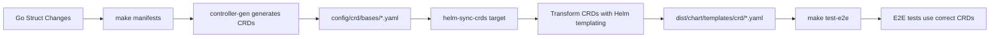

# CRD Synchronization Process

This document explains the automated CRD synchronization process that keeps Helm chart CRDs in sync with kubebuilder-generated CRDs.

## Overview

The homelab-autoscaler project uses kubebuilder to generate CRDs from Go struct definitions. These CRDs need to be synchronized with the Helm chart templates to ensure consistency between the Go code and the deployed resources.

## Problem Solved

Previously, CRDs in the Helm chart (`dist/chart/templates/crd/`) were manually maintained and could become outdated when the Go struct definitions changed. This led to:

- Schema mismatches between Go structs and deployed CRDs
- E2E test failures due to incorrect CRD schemas
- Manual maintenance overhead
- Risk of deploying incompatible CRD versions

## Solution Architecture

The automated CRD sync process integrates into the build pipeline:



## Components

### 1. CRD Sync Script (`hack/sync-helm-crds.sh`)

Transforms kubebuilder-generated CRDs into Helm-templated versions:

- **Input**: `config/crd/bases/*.yaml` (kubebuilder output)
- **Output**: `dist/chart/templates/crd/*.yaml` (Helm templates)
- **Transformations**:
  - Wraps CRDs with `{{- if .Values.crd.enable }}` conditional
  - Adds Helm labels: `{{- include "chart.labels" . | nindent 4 }}`
  - Adds conditional keep annotation: `{{- if .Values.crd.keep }}`
  - Preserves the exact schema from kubebuilder

### 2. Makefile Integration

- **`helm-sync-crds` target**: Runs the sync script
- **Dependency chain**: `manifests` → `helm-sync-crds` → `build` → `test-e2e`
- **Automatic execution**: CRDs are synced whenever manifests are generated

### 3. Validation Script (`hack/validate-helm-crds.sh`)

Validates that Helm chart CRDs match kubebuilder output:

- Compares schema sections between source and target CRDs
- Validates Helm templating is correctly applied
- Reports any inconsistencies or missing templates

## Usage

### Automatic Sync (Recommended)

The sync happens automatically when running standard build commands:

```bash
# Generate manifests and sync CRDs
make manifests

# Build project (includes CRD sync)
make build

# Run E2E tests (includes CRD sync)
make test-e2e
```

### Manual Sync

To manually sync CRDs:

```bash
# Sync CRDs from kubebuilder to Helm chart
make helm-sync-crds

# Validate CRD consistency
./hack/validate-helm-crds.sh
```

### Validation

To check if CRDs are in sync:

```bash
./hack/validate-helm-crds.sh
```

This will:
- Compare schemas between kubebuilder and Helm chart CRDs
- Validate Helm templating is correct
- Report any inconsistencies

## Development Workflow

When modifying Go struct definitions:

1. **Modify Go structs** in `api/infra/v1alpha1/`
2. **Run `make manifests`** - This automatically:
   - Generates new CRDs via controller-gen
   - Syncs CRDs to Helm chart
3. **Test changes** with `make test-e2e`
4. **Commit both Go changes and updated Helm CRDs**

## File Structure

```
├── api/infra/v1alpha1/
│   ├── group_types.go              # Go struct definitions
│   └── node_types.go
├── config/crd/bases/               # Kubebuilder-generated CRDs
│   ├── infra.homecluster.dev_groups.yaml
│   └── infra.homecluster.dev_nodes.yaml
├── dist/chart/templates/crd/       # Helm-templated CRDs
│   ├── infra.homecluster.dev_groups.yaml
│   └── infra.homecluster.dev_nodes.yaml
└── hack/
    ├── sync-helm-crds.sh          # CRD sync script
    └── validate-helm-crds.sh      # CRD validation script
```

## Helm Chart Integration

The synchronized CRDs integrate seamlessly with Helm chart features:

### Conditional Installation

```yaml
# CRDs are only installed if enabled
{{- if .Values.crd.enable }}
---
# CRD content here
{{- end -}}
```

### Resource Policy

```yaml
# CRDs can be preserved during uninstall
annotations:
  {{- if .Values.crd.keep }}
  "helm.sh/resource-policy": keep
  {{- end }}
```

### Labels

```yaml
# CRDs get standard Helm chart labels
labels:
  {{- include "chart.labels" . | nindent 4 }}
```

## Configuration

CRD behavior is controlled via Helm values:

```yaml
# values.yaml
crd:
  # Enable/disable CRD installation
  enable: true
  
  # Keep CRDs when uninstalling chart
  keep: true
```

## Troubleshooting

### CRD Schema Mismatch

If E2E tests fail with CRD schema errors:

1. Check if CRDs are in sync: `./hack/validate-helm-crds.sh`
2. Re-sync CRDs: `make helm-sync-crds`
3. Verify the Go struct matches expected schema

### Sync Script Failures

If the sync script fails:

1. Ensure kubebuilder CRDs exist: `ls config/crd/bases/`
2. Run `make manifests` to generate CRDs
3. Check script permissions: `chmod +x hack/sync-helm-crds.sh`

### Validation Failures

If validation reports schema differences:

1. Check for manual edits to Helm chart CRDs
2. Re-run sync: `make helm-sync-crds`
3. Verify Go struct changes are correct

## Benefits

- **Zero manual maintenance**: CRDs automatically stay in sync
- **Prevents schema drift**: Helm chart always matches Go structs
- **Reliable E2E tests**: Tests use correct CRD schemas
- **Preserves Helm features**: Conditional installation, labels, annotations
- **Developer friendly**: No changes to development workflow
- **Validation included**: Built-in consistency checking

## Future Enhancements

Potential improvements to consider:

- **CI/CD integration**: Validate CRD sync in GitHub Actions
- **Pre-commit hooks**: Ensure CRDs are synced before commits
- **Schema versioning**: Track CRD schema changes over time
- **Automated testing**: Unit tests for sync script functionality