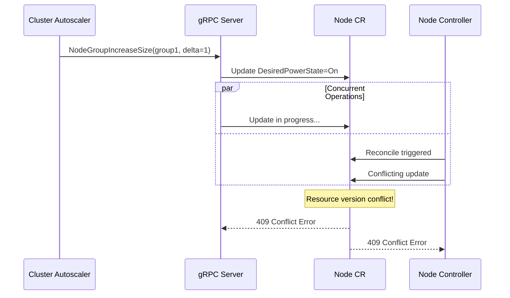
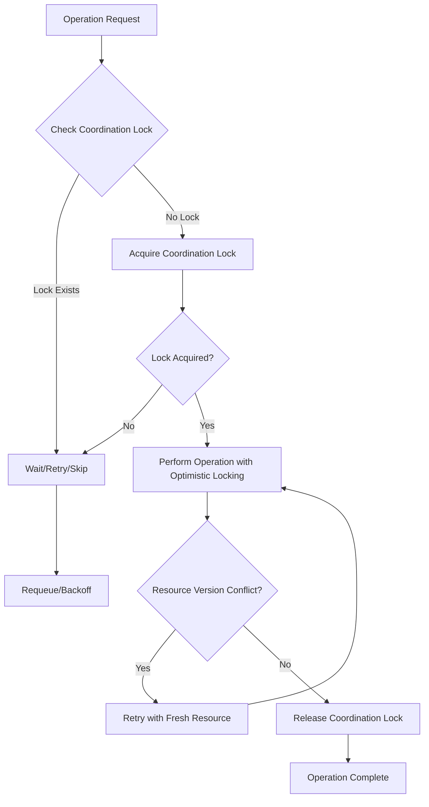

# Optimistic Locking Implementation Guide for Homelab-Autoscaler

## Table of Contents

1. [Optimistic Locking Overview](#optimistic-locking-overview)
2. [Current Implementation Analysis](#current-implementation-analysis)
3. [Detailed Implementation Guide](#detailed-implementation-guide)
4. [Specific Recommendations for Homelab-Autoscaler](#specific-recommendations-for-homelab-autoscaler)
5. [Implementation Patterns](#implementation-patterns)
6. [Testing and Validation](#testing-and-validation)
7. [Migration Guide](#migration-guide)
8. [Troubleshooting](#troubleshooting)

## Optimistic Locking Overview

### What is Optimistic Locking?

Optimistic locking is a concurrency control mechanism that assumes conflicts between concurrent operations are rare. Instead of locking resources during the entire operation, it validates that no other process has modified the resource before committing changes.

### Why Optimistic Locking for Kubernetes Controllers?

In Kubernetes controllers, optimistic locking is **essential** because:

1. **Multiple Controllers**: Different controllers may modify the same resource
2. **Concurrent Reconciliation**: The same controller may process multiple events for the same resource
3. **External Modifications**: Users or other systems may modify resources directly
4. **Resource Version Conflicts**: Kubernetes uses resource versions to detect concurrent modifications

### Benefits for Homelab-Autoscaler

- **Prevents Data Loss**: Ensures updates don't overwrite concurrent changes
- **Improves Reliability**: Reduces race conditions between controllers and gRPC server
- **Better Error Handling**: Provides clear feedback when conflicts occur
- **Scalability**: Allows multiple instances to run safely

### Trade-offs

**Advantages:**
- No deadlocks
- Better performance under low contention
- Natural fit for Kubernetes API patterns

**Disadvantages:**
- Requires retry logic
- May increase latency under high contention
- More complex error handling

## Coordination Annotations for Inter-Controller Coordination

### What are Coordination Annotations?

Coordination annotations are a proactive coordination mechanism that uses Kubernetes resource annotations to establish explicit locks and ownership before performing operations. Unlike optimistic locking which detects conflicts after they occur, coordination annotations prevent conflicts by establishing clear operation ownership upfront.

### Why Coordination Annotations for Homelab-Autoscaler?

In the homelab-autoscaler architecture, multiple components can modify the same Node CRs simultaneously:

1. **Cluster Autoscaler via gRPC**: Calls [`NodeGroupIncreaseSize()`](internal/grpcserver/server.go:349) and [`NodeGroupDeleteNodes()`](internal/grpcserver/server.go:406) to modify Node power states
2. **Node Controllers**: Reconcile Node CRs based on health checks and desired states
3. **Health Sync Background Process**: Updates Node status based on CronJob health checks

**The Race Condition Scenario:**


### Coordination Annotation Keys

The homelab-autoscaler uses four specific annotation keys for coordination:

#### 1. `homelab-autoscaler.dev/operation-lock`
**Purpose**: Indicates the type of active operation being performed
**Values**: 
- `power-state-change`: Node power state modification in progress
- `health-update`: Health status update in progress
- `reconciliation`: Controller reconciliation in progress

#### 2. `homelab-autoscaler.dev/lock-owner`
**Purpose**: Identifies which component owns the current lock
**Values**:
- `grpc-server`: Lock owned by gRPC server (cluster autoscaler operations)
- `node-controller`: Lock owned by Node controller
- `health-sync`: Lock owned by health sync process

#### 3. `homelab-autoscaler.dev/lock-timestamp`
**Purpose**: Records when the lock was acquired (RFC3339 format)
**Example**: `2024-01-15T10:30:45Z`

#### 4. `homelab-autoscaler.dev/lock-timeout`
**Purpose**: Specifies lock expiration duration in seconds
**Example**: `300` (5 minutes)

### Coordination Lock Acquisition

#### Basic Lock Acquisition Pattern

```go
type CoordinationLock struct {
    Operation string
    Owner     string
    Timeout   time.Duration
}

func (r *NodeReconciler) acquireCoordinationLock(ctx context.Context, node *infrav1alpha1.Node, lock CoordinationLock) error {
    logger := log.FromContext(ctx)
    
    // Check if lock already exists
    if existingLock, exists := r.checkExistingLock(node); exists {
        if r.isLockExpired(existingLock) {
            logger.Info("Existing lock expired, proceeding with acquisition", 
                "node", node.Name, 
                "expiredLock", existingLock.Operation)
        } else {
            return fmt.Errorf("coordination lock already exists: %s owned by %s", 
                existingLock.Operation, existingLock.Owner)
        }
    }
    
    // Acquire lock with retry
    return r.updateNodeWithRetry(ctx, node, func(n *infrav1alpha1.Node) {
        if n.Annotations == nil {
            n.Annotations = make(map[string]string)
        }
        
        n.Annotations["homelab-autoscaler.dev/operation-lock"] = lock.Operation
        n.Annotations["homelab-autoscaler.dev/lock-owner"] = lock.Owner
        n.Annotations["homelab-autoscaler.dev/lock-timestamp"] = time.Now().Format(time.RFC3339)
        n.Annotations["homelab-autoscaler.dev/lock-timeout"] = fmt.Sprintf("%.0f", lock.Timeout.Seconds())
    })
}
```

#### gRPC Server Lock Acquisition

```go
func (s *HomeClusterProviderServer) NodeGroupIncreaseSize(ctx context.Context, req *pb.NodeGroupIncreaseSizeRequest) (*pb.NodeGroupIncreaseSizeResponse, error) {
    logger := log.Log.WithName("grpc-server")
    logger.Info("NodeGroupIncreaseSize called", "nodeGroup", req.Id, "delta", req.Delta)
    
    // Find target node first
    node, err := s.findPoweredOffNode(ctx, req.Id)
    if err != nil {
        return nil, status.Errorf(codes.FailedPrecondition, "no powered off nodes found: %v", err)
    }
    
    // Acquire coordination lock
    lock := CoordinationLock{
        Operation: "power-state-change",
        Owner:     "grpc-server",
        Timeout:   5 * time.Minute,
    }
    
    if err := s.acquireCoordinationLock(ctx, node, lock); err != nil {
        return nil, status.Errorf(codes.ResourceExhausted, "failed to acquire coordination lock: %v", err)
    }
    
    // Ensure lock is released on completion
    defer func() {
        if releaseErr := s.releaseCoordinationLock(ctx, node); releaseErr != nil {
            logger.Error(releaseErr, "failed to release coordination lock", "node", node.Name)
        }
    }()
    
    // Perform the actual power state change
    return s.performPowerStateChange(ctx, node, infrav1alpha1.PowerStateOn)
}
```

### Coordination Lock Checking

#### Pre-Operation Lock Check

```go
func (r *NodeReconciler) checkCoordinationLock(ctx context.Context, node *infrav1alpha1.Node) (*CoordinationLock, bool) {
    logger := log.FromContext(ctx)
    
    if node.Annotations == nil {
        return nil, false
    }
    
    operation := node.Annotations["homelab-autoscaler.dev/operation-lock"]
    owner := node.Annotations["homelab-autoscaler.dev/lock-owner"]
    timestampStr := node.Annotations["homelab-autoscaler.dev/lock-timestamp"]
    timeoutStr := node.Annotations["homelab-autoscaler.dev/lock-timeout"]
    
    if operation == "" || owner == "" {
        return nil, false
    }
    
    // Parse timestamp and timeout
    timestamp, err := time.Parse(time.RFC3339, timestampStr)
    if err != nil {
        logger.Warning("Invalid lock timestamp, treating as no lock", "node", node.Name, "timestamp", timestampStr)
        return nil, false
    }
    
    timeout, err := strconv.ParseFloat(timeoutStr, 64)
    if err != nil {
        logger.Warning("Invalid lock timeout, using default", "node", node.Name, "timeout", timeoutStr)
        timeout = 300 // 5 minutes default
    }
    
    lock := &CoordinationLock{
        Operation: operation,
        Owner:     owner,
        Timeout:   time.Duration(timeout) * time.Second,
        Timestamp: timestamp,
    }
    
    // Check if lock is expired
    if time.Since(timestamp) > lock.Timeout {
        logger.Info("Coordination lock expired", 
            "node", node.Name, 
            "operation", operation, 
            "owner", owner,
            "age", time.Since(timestamp))
        return lock, false // Expired lock is treated as no lock
    }
    
    return lock, true
}

func (r *NodeReconciler) shouldSkipReconciliation(ctx context.Context, node *infrav1alpha1.Node) bool {
    lock, exists := r.checkCoordinationLock(ctx, node)
    if !exists {
        return false // No lock, proceed with reconciliation
    }
    
    logger := log.FromContext(ctx)
    
    // Skip if another component owns the lock
    if lock.Owner != "node-controller" {
        logger.Info("Skipping reconciliation due to coordination lock", 
            "node", node.Name, 
            "operation", lock.Operation, 
            "owner", lock.Owner)
        return true
    }
    
    return false // We own the lock, proceed
}
```

#### Controller Reconciliation with Lock Respect

```go
func (r *NodeReconciler) Reconcile(ctx context.Context, req ctrl.Request) (ctrl.Result, error) {
    logger := log.FromContext(ctx)
    
    // Get the Node CR
    node := &infrav1alpha1.Node{}
    if err := r.Get(ctx, req.NamespacedName, node); err != nil {
        return ctrl.Result{}, client.IgnoreNotFound(err)
    }
    
    // Check for coordination lock
    if r.shouldSkipReconciliation(ctx, node) {
        logger.Info("Reconciliation skipped due to coordination lock", "node", node.Name)
        return ctrl.Result{RequeueAfter: 30 * time.Second}, nil // Requeue to check later
    }
    
    // Acquire our own lock for reconciliation
    lock := CoordinationLock{
        Operation: "reconciliation",
        Owner:     "node-controller",
        Timeout:   2 * time.Minute,
    }
    
    if err := r.acquireCoordinationLock(ctx, node, lock); err != nil {
        logger.Info("Failed to acquire reconciliation lock, will retry", "node", node.Name, "error", err)
        return ctrl.Result{RequeueAfter: 10 * time.Second}, nil
    }
    
    // Ensure lock is released
    defer func() {
        if err := r.releaseCoordinationLock(ctx, node); err != nil {
            logger.Error(err, "failed to release coordination lock", "node", node.Name)
        }
    }()
    
    // Perform actual reconciliation logic
    return r.performReconciliation(ctx, node)
}
```

### Coordination Lock Release

#### Safe Lock Release Pattern

```go
func (r *NodeReconciler) releaseCoordinationLock(ctx context.Context, node *infrav1alpha1.Node) error {
    logger := log.FromContext(ctx)
    
    return r.updateNodeWithRetry(ctx, node, func(n *infrav1alpha1.Node) {
        if n.Annotations == nil {
            return // No annotations to clean up
        }
        
        // Only release if we own the lock
        currentOwner := n.Annotations["homelab-autoscaler.dev/lock-owner"]
        expectedOwner := r.getComponentName() // "node-controller", "grpc-server", etc.
        
        if currentOwner != expectedOwner {
            logger.Warning("Attempted to release lock owned by different component", 
                "node", n.Name, 
                "currentOwner", currentOwner, 
                "expectedOwner", expectedOwner)
            return
        }
        
        // Remove coordination annotations
        delete(n.Annotations, "homelab-autoscaler.dev/operation-lock")
        delete(n.Annotations, "homelab-autoscaler.dev/lock-owner")
        delete(n.Annotations, "homelab-autoscaler.dev/lock-timestamp")
        delete(n.Annotations, "homelab-autoscaler.dev/lock-timeout")
        
        logger.Info("Released coordination lock", "node", n.Name, "owner", expectedOwner)
    })
}
```

#### Automatic Lock Cleanup for Expired Locks

```go
func (r *NodeReconciler) cleanupExpiredLocks(ctx context.Context) error {
    logger := log.FromContext(ctx)
    
    // List all nodes to check for expired locks
    nodes := &infrav1alpha1.NodeList{}
    if err := r.List(ctx, nodes); err != nil {
        return fmt.Errorf("failed to list nodes for lock cleanup: %w", err)
    }
    
    for _, node := range nodes.Items {
        lock, exists := r.checkCoordinationLock(ctx, &node)
        if !exists {
            continue // No lock to clean up
        }
        

## Hybrid Approach: Combining Optimistic Locking and Coordination Annotations

### Why Use Both Approaches?

While coordination annotations prevent most race conditions proactively, combining them with optimistic locking provides a robust defense-in-depth strategy:

1. **Coordination Annotations**: Prevent conflicts before they occur (proactive)
2. **Optimistic Locking**: Handle conflicts that slip through (reactive)
3. **Together**: Provide comprehensive protection against all race condition scenarios

### Layered Protection Strategy



### Implementation Pattern

#### Combined Lock and Retry Pattern

```go
func (r *NodeReconciler) updateNodeWithCoordinationAndRetry(ctx context.Context, node *infrav1alpha1.Node, operation string, updateFunc func(*infrav1alpha1.Node)) error {
    logger := log.FromContext(ctx)
    
    // Step 1: Acquire coordination lock
    lock := CoordinationLock{
        Operation: operation,
        Owner:     "node-controller",
        Timeout:   2 * time.Minute,
    }
    
    if err := r.acquireCoordinationLock(ctx, node, lock); err != nil {
        return fmt.Errorf("failed to acquire coordination lock: %w", err)
    }
    
    // Ensure lock is always released
    defer func() {
        if err := r.releaseCoordinationLock(ctx, node); err != nil {
            logger.Error(err, "failed to release coordination lock", "node", node.Name)
        }
    }()
    
    // Step 2: Perform operation with optimistic locking retry
    return r.updateNodeWithRetry(ctx, node, func(fresh *infrav1alpha1.Node) {
        // Verify we still own the lock on the fresh resource
        if currentLock, exists := r.checkCoordinationLock(ctx, fresh); exists {
            if currentLock.Owner != "node-controller" {
                logger.Warning("Lock ownership changed during operation", 
                    "node", fresh.Name, 
                    "expectedOwner", "node-controller", 
                    "actualOwner", currentLock.Owner)
                return // Skip update if we no longer own the lock
            }
        }
        
        // Apply the update function
        updateFunc(fresh)
    })
}
```

#### gRPC Server Hybrid Pattern

```go
func (s *HomeClusterProviderServer) updateNodeWithCoordination(ctx context.Context, node *infrav1alpha1.Node, operation string, updateFunc func(*infrav1alpha1.Node)) error {
    logger := log.Log.WithName("grpc-server")
    
    // Acquire coordination lock first
    lock := CoordinationLock{
        Operation: operation,
        Owner:     "grpc-server",
        Timeout:   5 * time.Minute,
    }
    
    if err := s.acquireCoordinationLock(ctx, node, lock); err != nil {
        return status.Errorf(codes.ResourceExhausted, "coordination lock acquisition failed: %v", err)
    }
    
    defer func() {
        if err := s.releaseCoordinationLock(ctx, node); err != nil {
            logger.Error(err, "failed to release coordination lock", "node", node.Name)
        }
    }()
    
    // Use optimistic locking for the actual update
    const maxRetries = 3
    for attempt := 0; attempt < maxRetries; attempt++ {
        // Get fresh copy
        fresh := &infrav1alpha1.Node{}
        if err := s.Client.Get(ctx, client.ObjectKeyFromObject(node), fresh); err != nil {
            return status.Errorf(codes.Internal, "failed to get fresh node: %v", err)
        }
        
        // Verify lock is still valid
        if currentLock, exists := s.checkCoordinationLock(ctx, fresh); !exists || currentLock.Owner != "grpc-server" {
            return status.Errorf(codes.FailedPrecondition, "coordination lock lost during operation")
        }
        
        // Apply update
        updateFunc(fresh)
        
        // Attempt update with optimistic locking
        if err := s.Client.Update(ctx, fresh); err != nil {
            if errors.IsConflict(err) {
                logger.Info("Optimistic locking conflict, retrying", 
                    "node", node.Name, 
                    "attempt", attempt+1)
                continue
            }
            return status.Errorf(codes.Internal, "update failed: %v", err)
        }
        
        return nil // Success
    }
    
    return status.Errorf(codes.Internal, "update failed after %d attempts", maxRetries)
}
```

### Conflict Resolution Hierarchy

When both mechanisms detect issues, follow this resolution hierarchy:

#### 1. Coordination Lock Takes Precedence
```go
func (r *NodeReconciler) resolveConflict(ctx context.Context, node *infrav1alpha1.Node, conflictErr error) error {
    logger := log.FromContext(ctx)
    
    // Check if there's a coordination lock conflict
    if lock, exists := r.checkCoordinationLock(ctx, node); exists {
        if lock.Owner != r.getComponentName() {
            logger.Info("Conflict due to coordination lock, backing off", 
                "node", node.Name, 
                "lockOwner", lock.Owner)
            return fmt.Errorf("coordination lock conflict: %w", conflictErr)
        }
    }
    
    // If we own the lock or no lock exists, handle as optimistic locking conflict
    if errors.IsConflict(conflictErr) {
        logger.Info("Resource version conflict, will retry", "node", node.Name)
        return conflictErr // Let retry mechanism handle it
    }
    
    return conflictErr
}
```

#### 2. Lock Validation During Retries
```go
func (r *NodeReconciler) validateLockDuringRetry(ctx context.Context, node *infrav1alpha1.Node) error {
    if lock, exists := r.checkCoordinationLock(ctx, node); exists {
        if lock.Owner != r.getComponentName() {
            return fmt.Errorf("coordination lock ownership changed during retry")
        }
        
        // Check if lock is about to expire
        timeRemaining := lock.Timeout - time.Since(lock.Timestamp)
        if timeRemaining < 30*time.Second {
            return fmt.Errorf("coordination lock expiring soon, aborting operation")
        }
    }
    
    return nil
}
```

### Performance Considerations

#### Optimized Lock Checking
```go
// Cache lock information to avoid repeated annotation parsing
type LockCache struct {
    mu    sync.RWMutex
    locks map[string]*CachedLock
}

type CachedLock struct {
    Lock      *CoordinationLock
    ExpiresAt time.Time
    Valid     bool
}

func (lc *LockCache) GetLock(nodeKey string) (*CoordinationLock, bool) {
    lc.mu.RLock()
    defer lc.mu.RUnlock()
    
    cached, exists := lc.locks[nodeKey]
    if !exists || time.Now().After(cached.ExpiresAt) {
        return nil, false
    }
    
    return cached.Lock, cached.Valid
}
```

#### Batch Lock Operations
```go
func (s *HomeClusterProviderServer) batchUpdateWithCoordination(ctx context.Context, nodes []*infrav1alpha1.Node, operation string, updateFunc func(*infrav1alpha1.Node)) error {
    // Acquire all locks first
    var acquiredLocks []*infrav1alpha1.Node
    defer func() {
        // Release all acquired locks
        for _, node := range acquiredLocks {
            if err := s.releaseCoordinationLock(ctx, node); err != nil {
                log.Log.Error(err, "failed to release batch lock", "node", node.Name)
            }
        }
    }()
    
    // Try to acquire locks for all nodes
    for _, node := range nodes {
        lock := CoordinationLock{
            Operation: operation,
            Owner:     "grpc-server",
            Timeout:   5 * time.Minute,
        }
        
        if err := s.acquireCoordinationLock(ctx, node, lock); err != nil {
            return fmt.Errorf("failed to acquire lock for node %s: %w", node.Name, err)
        }
        
        acquiredLocks = append(acquiredLocks, node)
    }
    
    // Perform batch update with optimistic locking
    for _, node := range nodes {
        if err := s.updateNodeWithRetry(ctx, node, updateFunc); err != nil {
            return fmt.Errorf("batch update failed for node %s: %w", node.Name, err)
        }
    }
    
    return nil
}
```

### Testing the Hybrid Approach

#### Integration Test for Combined Mechanisms
```go
func TestHybridCoordinationAndOptimisticLocking(t *testing.T) {
    ctx := context.Background()
    client := fake.NewClientBuilder().WithScheme(scheme).Build()
    
    // Create test node
    node := &infrav1alpha1.Node{
        ObjectMeta: metav1.ObjectMeta{
            Name:      "test-node",
            Namespace: "homelab-autoscaler-system",
        },
    }
    require.NoError(t, client.Create(ctx, node))
    
    // Test concurrent operations with coordination
    var wg sync.WaitGroup
    results := make(chan error, 3)
    
    // Simulate gRPC server operation
    wg.Add(1)
    go func() {
        defer wg.Done()
        server := &HomeClusterProviderServer{Client: client}
        err := server.updateNodeWithCoordination(ctx, node, "power-state-change", func(n *infrav1alpha1.Node) {
            n.Spec.DesiredPowerState = infrav1alpha1.PowerStateOn
        })
        results <- err
    }()
    
    // Simulate controller reconciliation
    wg.Add(1)
    go func() {
        defer wg.Done()
        reconciler := &NodeReconciler{Client: client}
        err := reconciler.updateNodeWithCoordinationAndRetry(ctx, node, "reconciliation", func(n *infrav1alpha1.Node) {
            n.Status.Progress = infrav1alpha1.ProgressReady
        })
        results <- err
    }()
    
    // Simulate health sync
    wg.Add(1)
    go func() {
        defer wg.Done()
        healthSync := &HealthSyncManager{Client: client}
        err := healthSync.updateNodeWithCoordination(ctx, node, "health-update", func(n *infrav1alpha1.Node) {
            n.Status.PowerState = infrav1alpha1.PowerStateOn
        })
        results <- err
    }()
    
    wg.Wait()
    close(results)
    
    // Verify results - only one should succeed, others should handle coordination gracefully
    successCount := 0
    coordinationConflicts := 0
    
    for err := range results {
        if err == nil {
            successCount++
        } else if strings.Contains(err.Error(), "coordination lock") {
            coordinationConflicts++
        } else {
            t.Errorf("Unexpected error: %v", err)
        }
    }
    
    assert.Equal(t, 1, successCount, "Exactly one operation should succeed")
    assert.Equal(t, 2, coordinationConflicts, "Two operations should be blocked by coordination")
}
```

### Best Practices for Hybrid Approach

1. **Always Acquire Coordination Lock First**: Establish ownership before any modifications
2. **Use Appropriate Timeouts**: Balance between operation time and lock contention
3. **Validate Lock Ownership**: Check lock ownership on fresh resources during retries
4. **Graceful Degradation**: Handle lock acquisition failures appropriately
5. **Monitor Both Mechanisms**: Track both coordination conflicts and optimistic locking retries
6. **Clean Up Proactively**: Implement background cleanup for expired locks

        // Check if lock is expired
        if time.Since(lock.Timestamp) > lock.Timeout {
            logger.Info("Cleaning up expired coordination lock", 
                "node", node.Name, 
                "operation", lock.Operation, 
                "owner", lock.Owner,
                "age", time.Since(lock.Timestamp))
            
            if err := r.forceReleaseLock(ctx, &node); err != nil {
                logger.Error(err, "failed to cleanup expired lock", "node", node.Name)
            }
        }
    }
    
    return nil
}

// Run cleanup periodically
func (r *NodeReconciler) startLockCleanupWorker(ctx context.Context) {
    ticker := time.NewTicker(1 * time.Minute)
    defer ticker.Stop()
    
    for {
        select {
        case <-ctx.Done():
            return
        case <-ticker.C:
            if err := r.cleanupExpiredLocks(ctx); err != nil {
                log.Log.Error(err, "lock cleanup failed")
            }
        }
    }
}
```

### Solving the Cluster Autoscaler Race Condition

The coordination annotations approach specifically solves the race condition between cluster autoscaler and homelab-autoscaler controllers:

#### Problem Scenario
1. **Cluster Autoscaler** calls `NodeGroupIncreaseSize` via gRPC
2. **gRPC Server** starts updating Node CR `DesiredPowerState`
3. **Node Controller** simultaneously reconciles the same Node CR
4. **Result**: Resource version conflict, operation failure

#### Solution with Coordination Annotations
1. **gRPC Server** acquires `power-state-change` lock before modification
2. **Node Controller** checks for lock during reconciliation
3. **Node Controller** skips or waits if lock exists
4. **gRPC Server** completes operation and releases lock
5. **Node Controller** can now safely reconcile

#### Enhanced gRPC Methods with Coordination

```go
func (s *HomeClusterProviderServer) NodeGroupDeleteNodes(ctx context.Context, req *pb.NodeGroupDeleteNodesRequest) (*pb.NodeGroupDeleteNodesResponse, error) {
    logger := log.Log.WithName("grpc-server")
    logger.Info("NodeGroupDeleteNodes called", "nodeGroup", req.Id, "nodes", len(req.Nodes))
    
    // Process each node with coordination
    for _, nodeToDelete := range req.Nodes {
        // Get Node CR
        nodeCR := &infrav1alpha1.Node{}
        if err := s.Client.Get(ctx, client.ObjectKey{Name: nodeToDelete.Name, Namespace: "homelab-autoscaler-system"}, nodeCR); err != nil {
            return nil, status.Errorf(codes.Internal, "failed to get node %s: %v", nodeToDelete.Name, err)
        }
        
        // Acquire coordination lock
        lock := CoordinationLock{
            Operation: "power-state-change",
            Owner:     "grpc-server",
            Timeout:   5 * time.Minute,
        }
        
        if err := s.acquireCoordinationLock(ctx, nodeCR, lock); err != nil {
            logger.Warning("Failed to acquire lock, skipping node", "node", nodeToDelete.Name, "error", err)
            continue
        }
        
        // Perform power state change with lock protection
        err := s.updateNodeWithRetry(ctx, nodeCR, func(n *infrav1alpha1.Node) {
            n.Spec.DesiredPowerState = infrav1alpha1.PowerStateOff
        })
        
        // Always release lock
        if releaseErr := s.releaseCoordinationLock(ctx, nodeCR); releaseErr != nil {
            logger.Error(releaseErr, "failed to release lock", "node", nodeToDelete.Name)
        }
        
        if err != nil {
            return nil, status.Errorf(codes.Internal, "failed to update node %s: %v", nodeToDelete.Name, err)
        }
    }
    
    return &pb.NodeGroupDeleteNodesResponse{}, nil
}
```

### Benefits of Coordination Annotations

1. **Proactive Conflict Prevention**: Prevents race conditions before they occur
2. **Clear Operation Visibility**: Easy to see which component is performing operations
3. **Timeout Protection**: Automatic cleanup of stale locks prevents deadlocks
4. **Minimal Performance Impact**: Annotation-based approach has low overhead
5. **Debugging Friendly**: Lock information visible in `kubectl describe` output
6. **Complementary to Optimistic Locking**: Works alongside resource version checks

## Current Implementation Analysis

### Existing Optimistic Locking Mechanisms

#### 1. Controller-Runtime Built-in Support

The project already uses controller-runtime, which provides optimistic locking through:

**Resource Versions** (in [`internal/controller/infra/group_controller.go:74`](internal/controller/infra/group_controller.go:74)):
```go
// Update the Group in the cluster
if err := r.Status().Update(ctx, group); err != nil {
    logger.Error(err, "Failed to update Group status", "group", req.Name)
    return ctrl.Result{}, err
}
```

**Status Subresource Usage** (in [`api/infra/v1alpha1/group_types.go:74`](api/infra/v1alpha1/group_types.go:74)):
```go
// +kubebuilder:subresource:status
```

#### 2. Current Patterns in Node Controller

**Basic Update Pattern** (in [`internal/controller/infra/node_controller.go:289`](internal/controller/infra/node_controller.go:289)):
```go
// Update the Node with the new status info
if err := r.Update(ctx, nodeCR); err != nil {
    logger.Error(err, "Failed to update Node with status condition", "node", nodeCR.Name)
    return err
}
```

**Patch-based Updates** (in [`internal/controller/infra/node_controller.go:183`](internal/controller/infra/node_controller.go:183)):
```go
// Create a patch with the new label
patch := client.MergeFrom(kubernetesNode.DeepCopy())
// Apply the patch
if err := r.Patch(ctx, kubernetesNode, patch); err != nil {
    logger.Error(err, "Failed to patch Kubernetes node with label", "node", nodeName, "label", labelKey)
    return err
}
```

#### 3. gRPC Server State Management

**Direct Client Updates** (in [`internal/grpcserver/server.go:370`](internal/grpcserver/server.go:370)):
```go
if err := s.Client.Update(ctx, node); err != nil {
    logger.Error(err, "failed to update node DesiredPowerState", "node", nodeName)
    return nil, status.Errorf(codes.Internal, "failed to update node %s DesiredPowerState to on: %v", nodeName, err)
}
```

### Current Issues and Gaps

1. **No Retry Logic**: Updates fail permanently on conflicts
2. **Mixed Update Patterns**: Some use `Update()`, others use `Status().Update()`
3. **No Conflict Detection**: No specific handling for resource version conflicts
4. **gRPC Race Conditions**: Multiple gRPC requests can conflict
5. **Status vs Spec Coordination**: No clear separation of concerns

## Detailed Implementation Guide

### 1. Resource Version Conflict Handling

#### Basic Retry Pattern

```go
func (r *NodeReconciler) updateNodeWithRetry(ctx context.Context, node *infrav1alpha1.Node, updateFunc func(*infrav1alpha1.Node)) error {
    logger := log.FromContext(ctx)
    
    const maxRetries = 3
    const baseDelay = 100 * time.Millisecond
    
    for attempt := 0; attempt < maxRetries; attempt++ {
        // Get fresh copy of the resource
        fresh := &infrav1alpha1.Node{}
        if err := r.Get(ctx, client.ObjectKeyFromObject(node), fresh); err != nil {
            return fmt.Errorf("failed to get fresh node: %w", err)
        }
        
        // Apply the update function
        updateFunc(fresh)
        
        // Attempt the update
        if err := r.Update(ctx, fresh); err != nil {
            if errors.IsConflict(err) {
                // Exponential backoff
                delay := baseDelay * time.Duration(1<<attempt)
                logger.Info("Resource conflict, retrying", 
                    "node", node.Name, 
                    "attempt", attempt+1, 
                    "delay", delay)
                
                select {
                case <-ctx.Done():
                    return ctx.Err()
                case <-time.After(delay):
                    continue
                }
            }
            return fmt.Errorf("failed to update node: %w", err)
        }
        
        logger.Info("Successfully updated node", "node", node.Name, "attempts", attempt+1)
        return nil
    }
    
    return fmt.Errorf("failed to update node after %d attempts", maxRetries)
}
```

#### Status-Only Updates with Retry

```go
func (r *NodeReconciler) updateNodeStatusWithRetry(ctx context.Context, node *infrav1alpha1.Node, updateFunc func(*infrav1alpha1.Node)) error {
    logger := log.FromContext(ctx)
    
    const maxRetries = 3
    
    for attempt := 0; attempt < maxRetries; attempt++ {
        // Get fresh copy for status update
        fresh := &infrav1alpha1.Node{}
        if err := r.Get(ctx, client.ObjectKeyFromObject(node), fresh); err != nil {
            return fmt.Errorf("failed to get fresh node for status update: %w", err)
        }
        
        // Apply status update
        updateFunc(fresh)
        
        // Update only status subresource
        if err := r.Status().Update(ctx, fresh); err != nil {
            if errors.IsConflict(err) {
                logger.Info("Status update conflict, retrying", 
                    "node", node.Name, 
                    "attempt", attempt+1)
                continue
            }
            return fmt.Errorf("failed to update node status: %w", err)
        }
        
        return nil
    }
    
    return fmt.Errorf("failed to update node status after %d attempts", maxRetries)
}
```

### 2. Advanced Retry Strategies

#### Exponential Backoff with Jitter

```go
type RetryConfig struct {
    MaxRetries  int
    BaseDelay   time.Duration
    MaxDelay    time.Duration
    Multiplier  float64
    Jitter      bool
}

func (r *NodeReconciler) updateWithAdvancedRetry(ctx context.Context, obj client.Object, updateFunc func(client.Object), config RetryConfig) error {
    logger := log.FromContext(ctx)
    
    for attempt := 0; attempt < config.MaxRetries; attempt++ {
        // Get fresh copy
        fresh := obj.DeepCopyObject().(client.Object)
        if err := r.Get(ctx, client.ObjectKeyFromObject(obj), fresh); err != nil {
            return fmt.Errorf("failed to get fresh object: %w", err)
        }
        
        // Apply update
        updateFunc(fresh)
        
        // Attempt update
        if err := r.Update(ctx, fresh); err != nil {
            if errors.IsConflict(err) {
                delay := r.calculateBackoffDelay(attempt, config)
                logger.Info("Conflict detected, backing off", 
                    "object", client.ObjectKeyFromObject(obj),
                    "attempt", attempt+1,
                    "delay", delay)
                
                select {
                case <-ctx.Done():
                    return ctx.Err()
                case <-time.After(delay):
                    continue
                }
            }
            return err
        }
        
        return nil
    }
    
    return fmt.Errorf("failed after %d attempts", config.MaxRetries)
}

func (r *NodeReconciler) calculateBackoffDelay(attempt int, config RetryConfig) time.Duration {
    delay := config.BaseDelay * time.Duration(math.Pow(config.Multiplier, float64(attempt)))
    
    if delay > config.MaxDelay {
        delay = config.MaxDelay
    }
    
    if config.Jitter {
        // Add ±25% jitter
        jitter := time.Duration(rand.Float64() * 0.5 * float64(delay))
        if rand.Float64() < 0.5 {
            delay -= jitter
        } else {
            delay += jitter
        }
    }
    
    return delay
}
```

### 3. Generation-Based Change Detection

#### Avoiding Infinite Reconciliation Loops

```go
func (r *NodeReconciler) shouldReconcile(ctx context.Context, node *infrav1alpha1.Node) bool {
    logger := log.FromContext(ctx)
    
    // Check if only status changed (Generation field comparison)
    if node.Generation == node.Status.ObservedGeneration {
        logger.V(1).Info("No spec changes detected, skipping reconciliation", 
            "node", node.Name,
            "generation", node.Generation,
            "observedGeneration", node.Status.ObservedGeneration)
        return false
    }
    
    return true
}

func (r *NodeReconciler) updateObservedGeneration(node *infrav1alpha1.Node) {
    // Update observed generation to match current generation
    node.Status.ObservedGeneration = node.Generation
}
```

### 4. Coordinated Spec and Status Updates

#### Separate Update Patterns

```go
func (r *NodeReconciler) reconcileNodePowerState(ctx context.Context, node *infrav1alpha1.Node) error {
    logger := log.FromContext(ctx)
    
    // 1. Update spec if needed (with retry)
    if node.Spec.DesiredPowerState != node.Status.PowerState {
        if err := r.updateNodeSpecWithRetry(ctx, node, func(n *infrav1alpha1.Node) {
            // Spec updates only
            n.Spec.DesiredPowerState = infrav1alpha1.PowerStateOn
        }); err != nil {
            return fmt.Errorf("failed to update node spec: %w", err)
        }
    }
    
    // 2. Update status separately (with retry)
    if err := r.updateNodeStatusWithRetry(ctx, node, func(n *infrav1alpha1.Node) {
        // Status updates only
        n.Status.Progress = infrav1alpha1.ProgressStartingUp
        n.Status.LastStartupTime = &metav1.Time{Time: time.Now()}
        r.updateObservedGeneration(n)
        
        // Update conditions
        condition := metav1.Condition{
            Type:               "Progressing",
            Status:             metav1.ConditionTrue,
            LastTransitionTime: metav1.Now(),
            Reason:             "PowerStateTransition",
            Message:            "Node is transitioning to desired power state",
        }
        meta.SetStatusCondition(&n.Status.Conditions, condition)
    }); err != nil {
        return fmt.Errorf("failed to update node status: %w", err)
    }
    
    return nil
}
```

## Specific Recommendations for Homelab-Autoscaler

### 1. gRPC Server Request Deduplication

#### Idempotency Keys

```go
type RequestTracker struct {
    mu       sync.RWMutex
    requests map[string]*RequestInfo
    ttl      time.Duration
}

type RequestInfo struct {
    Timestamp time.Time
    Result    interface{}
    Error     error
}

func (s *HomeClusterProviderServer) NodeGroupIncreaseSize(ctx context.Context, req *pb.NodeGroupIncreaseSizeRequest) (*pb.NodeGroupIncreaseSizeResponse, error) {
    logger := log.Log.WithName("grpc-server")
    
    // Generate idempotency key
    idempotencyKey := fmt.Sprintf("increase-%s-%d-%d", req.Id, req.Delta, time.Now().Unix()/60) // 1-minute window
    
    // Check for duplicate request
    if result, exists := s.requestTracker.GetResult(idempotencyKey); exists {
        logger.Info("Returning cached result for duplicate request", "key", idempotencyKey)
        if result.Error != nil {
            return nil, result.Error
        }
        return result.Result.(*pb.NodeGroupIncreaseSizeResponse), nil
    }
    
    // Process request with optimistic locking
    response, err := s.processNodeGroupIncreaseWithRetry(ctx, req)
    
    // Cache result
    s.requestTracker.SetResult(idempotencyKey, response, err)
    
    return response, err
}

func (s *HomeClusterProviderServer) processNodeGroupIncreaseWithRetry(ctx context.Context, req *pb.NodeGroupIncreaseSizeRequest) (*pb.NodeGroupIncreaseSizeResponse, error) {
    const maxRetries = 3
    
    for attempt := 0; attempt < maxRetries; attempt++ {
        if err := s.processNodeGroupIncrease(ctx, req); err != nil {
            if errors.IsConflict(err) {
                logger.Info("Conflict in gRPC operation, retrying", 
                    "nodeGroup", req.Id, 
                    "attempt", attempt+1)
                continue
            }
            return nil, err
        }
        return &pb.NodeGroupIncreaseSizeResponse{}, nil
    }
    
    return nil, status.Errorf(codes.Internal, "failed to increase node group size after %d attempts", maxRetries)
}
```

### 2. Controller Coordination Patterns

#### Shared State Management

```go
type StateManager struct {
    client client.Client
    scheme *runtime.Scheme
    mu     sync.RWMutex
    cache  map[string]*CachedState
}

type CachedState struct {
    ResourceVersion string
    LastUpdate      time.Time
    Data            interface{}
}

func (sm *StateManager) GetNodeWithLock(ctx context.Context, name string) (*infrav1alpha1.Node, func(), error) {
    sm.mu.Lock()
    defer sm.mu.Unlock()
    
    node := &infrav1alpha1.Node{}
    if err := sm.client.Get(ctx, client.ObjectKey{Name: name}, node); err != nil {
        return nil, nil, err
    }
    
    // Return unlock function
    unlock := func() {
        sm.mu.Unlock()
    }
    
    return node, unlock, nil
}
```

### 3. Cross-Controller State Management

#### Event-Driven Updates

```go
func (r *NodeReconciler) handleCrossControllerUpdate(ctx context.Context, node *infrav1alpha1.Node) error {
    logger := log.FromContext(ctx)
    
    // Check if update came from external source
    if node.Annotations["homelab-autoscaler.dev/updated-by"] != "node-controller" {
        logger.Info("External update detected, validating state", "node", node.Name)
        
        // Validate and potentially correct state
        if err := r.validateAndCorrectState(ctx, node); err != nil {
            return fmt.Errorf("failed to validate external update: %w", err)
        }
    }
    
    // Mark as processed by this controller
    return r.updateNodeWithRetry(ctx, node, func(n *infrav1alpha1.Node) {
        if n.Annotations == nil {
            n.Annotations = make(map[string]string)
        }
        n.Annotations["homelab-autoscaler.dev/updated-by"] = "node-controller"
        n.Annotations["homelab-autoscaler.dev/last-update"] = time.Now().Format(time.RFC3339)
    })
}
```

### 4. Operation-Level Locking for Critical Paths

#### Critical Section Protection

```go
type OperationLock struct {
    mu    sync.Mutex
    locks map[string]*sync.Mutex
}

func (ol *OperationLock) LockOperation(operationKey string) func() {
    ol.mu.Lock()
    if ol.locks == nil {
        ol.locks = make(map[string]*sync.Mutex)
    }
    
    lock, exists := ol.locks[operationKey]
    if !exists {
        lock = &sync.Mutex{}
        ol.locks[operationKey] = lock
    }
    ol.mu.Unlock()
    
    lock.Lock()
    return lock.Unlock
}

func (r *NodeReconciler) handleCriticalPowerStateChange(ctx context.Context, node *infrav1alpha1.Node) error {
    // Lock critical operation
    unlock := r.operationLock.LockOperation(fmt.Sprintf("power-state-%s", node.Name))
    defer unlock()
    
    // Perform critical state change with optimistic locking
    return r.updateNodeWithRetry(ctx, node, func(n *infrav1alpha1.Node) {
        // Critical power state logic
        n.Spec.DesiredPowerState = infrav1alpha1.PowerStateOn
    })
}
```

## Implementation Patterns

### 5. Coordination Annotations Patterns

#### Pattern 1: Proactive Lock Acquisition

```go
type CoordinationManager struct {
    client client.Client
    owner  string
}

func NewCoordinationManager(client client.Client, owner string) *CoordinationManager {
    return &CoordinationManager{
        client: client,
        owner:  owner,
    }
}

func (cm *CoordinationManager) WithCoordinationLock(ctx context.Context, node *infrav1alpha1.Node, operation string, timeout time.Duration, fn func(*infrav1alpha1.Node) error) error {
    // Acquire lock
    lock := CoordinationLock{
        Operation: operation,
        Owner:     cm.owner,
        Timeout:   timeout,
    }
    
    if err := cm.acquireLock(ctx, node, lock); err != nil {
        return fmt.Errorf("failed to acquire coordination lock: %w", err)
    }
    
    // Ensure cleanup
    defer func() {
        if err := cm.releaseLock(ctx, node); err != nil {
            log.Log.Error(err, "failed to release coordination lock", "node", node.Name)
        }
    }()
    
    // Execute protected operation
    return fn(node)
}

// Usage example
func (r *NodeReconciler) updatePowerState(ctx context.Context, node *infrav1alpha1.Node, desiredState infrav1alpha1.PowerState) error {
    cm := NewCoordinationManager(r.Client, "node-controller")
    
    return cm.WithCoordinationLock(ctx, node, "power-state-change", 2*time.Minute, func(n *infrav1alpha1.Node) error {
        return r.updateNodeWithRetry(ctx, n, func(fresh *infrav1alpha1.Node) {
            fresh.Spec.DesiredPowerState = desiredState
        })
    })
}
```

#### Pattern 2: Lock-Aware Reconciliation

```go
func (r *NodeReconciler) Reconcile(ctx context.Context, req ctrl.Request) (ctrl.Result, error) {
    logger := log.FromContext(ctx)
    
    node := &infrav1alpha1.Node{}
    if err := r.Get(ctx, req.NamespacedName, node); err != nil {
        return ctrl.Result{}, client.IgnoreNotFound(err)
    }
    
    // Check for coordination locks
    if lock, exists := r.checkCoordinationLock(ctx, node); exists {
        if lock.Owner != "node-controller" {
            logger.Info("Skipping reconciliation due to coordination lock", 
                "node", node.Name, 
                "operation", lock.Operation, 
                "owner", lock.Owner)
            
            // Requeue after lock should expire
            requeueAfter := time.Until(lock.Timestamp.Add(lock.Timeout))
            if requeueAfter < 0 {
                requeueAfter = 30 * time.Second // Default requeue
            }
            
            return ctrl.Result{RequeueAfter: requeueAfter}, nil
        }
    }
    
    // Proceed with normal reconciliation
    return r.performReconciliation(ctx, node)
}
```

#### Pattern 3: gRPC Server Coordination Integration

```go
func (s *HomeClusterProviderServer) NodeGroupIncreaseSize(ctx context.Context, req *pb.NodeGroupIncreaseSizeRequest) (*pb.NodeGroupIncreaseSizeResponse, error) {
    logger := log.Log.WithName("grpc-server")
    
    // Find target node
    node, err := s.findPoweredOffNode(ctx, req.Id)
    if err != nil {
        return nil, status.Errorf(codes.FailedPrecondition, "no powered off nodes found: %v", err)
    }
    
    // Use coordination manager
    cm := NewCoordinationManager(s.Client, "grpc-server")
    
    err = cm.WithCoordinationLock(ctx, node, "power-state-change", 5*time.Minute, func(n *infrav1alpha1.Node) error {
        return s.updateNodeWithRetry(ctx, n, func(fresh *infrav1alpha1.Node) {
            fresh.Spec.DesiredPowerState = infrav1alpha1.PowerStateOn
        })
    })
    
    if err != nil {
        return nil, status.Errorf(codes.Internal, "failed to update node: %v", err)
    }
    
    logger.Info("Successfully increased node group size", "nodeGroup", req.Id, "node", node.Name)
    return &pb.NodeGroupIncreaseSizeResponse{}, nil
}
```

#### Pattern 4: Batch Operations with Coordination

```go
func (s *HomeClusterProviderServer) coordinatedBatchUpdate(ctx context.Context, nodes []*infrav1alpha1.Node, operation string, updateFunc func(*infrav1alpha1.Node)) error {
    type lockResult struct {
        node *infrav1alpha1.Node
        err  error
    }
    
    // Phase 1: Acquire all locks
    lockResults := make(chan lockResult, len(nodes))
    var wg sync.WaitGroup
    
    for _, node := range nodes {
        wg.Add(1)
        go func(n *infrav1alpha1.Node) {
            defer wg.Done()
            
            cm := NewCoordinationManager(s.Client, "grpc-server")
            lock := CoordinationLock{
                Operation: operation,
                Owner:     "grpc-server",
                Timeout:   5 * time.Minute,
            }
            
            err := cm.acquireLock(ctx, n, lock)
            lockResults <- lockResult{node: n, err: err}
        }(node)
    }
    
    wg.Wait()
    close(lockResults)
    
    // Check lock acquisition results
    var acquiredNodes []*infrav1alpha1.Node
    var failedNodes []string
    
    for result := range lockResults {
        if result.err != nil {
            failedNodes = append(failedNodes, result.node.Name)
        } else {
            acquiredNodes = append(acquiredNodes, result.node)
        }
    }
    
    // Release all acquired locks on completion
    defer func() {
        for _, node := range acquiredNodes {
            cm := NewCoordinationManager(s.Client, "grpc-server")
            if err := cm.releaseLock(ctx, node); err != nil {
                log.Log.Error(err, "failed to release batch lock", "node", node.Name)
            }
        }
    }()
    
    if len(failedNodes) > 0 {
        return fmt.Errorf("failed to acquire locks for nodes: %v", failedNodes)
    }
    
    // Phase 2: Perform batch updates
    for _, node := range acquiredNodes {
        if err := s.updateNodeWithRetry(ctx, node, updateFunc); err != nil {
            return fmt.Errorf("batch update failed for node %s: %w", node.Name, err)
        }
    }
    
    return nil
}
```

#### Pattern 5: Lock Timeout and Cleanup

```go
type LockCleanupManager struct {
    client   client.Client
    interval time.Duration
    ctx      context.Context
    cancel   context.CancelFunc
}

func NewLockCleanupManager(client client.Client, interval time.Duration) *LockCleanupManager {
    ctx, cancel := context.WithCancel(context.Background())
    return &LockCleanupManager{
        client:   client,
        interval: interval,
        ctx:      ctx,
        cancel:   cancel,
    }
}

func (lcm *LockCleanupManager) Start() {
    ticker := time.NewTicker(lcm.interval)
    defer ticker.Stop()
    
    for {
        select {
        case <-lcm.ctx.Done():
            return
        case <-ticker.C:
            if err := lcm.cleanupExpiredLocks(); err != nil {
                log.Log.Error(err, "lock cleanup failed")
            }
        }
    }
}

func (lcm *LockCleanupManager) Stop() {
    lcm.cancel()
}

func (lcm *LockCleanupManager) cleanupExpiredLocks() error {
    nodes := &infrav1alpha1.NodeList{}
    if err := lcm.client.List(lcm.ctx, nodes); err != nil {
        return fmt.Errorf("failed to list nodes: %w", err)
    }
    
    for _, node := range nodes.Items {
        if err := lcm.cleanupNodeLock(&node); err != nil {
            log.Log.Error(err, "failed to cleanup node lock", "node", node.Name)
        }
    }
    
    return nil
}

func (lcm *LockCleanupManager) cleanupNodeLock(node *infrav1alpha1.Node) error {
    if node.Annotations == nil {
        return nil
    }
    
    timestampStr := node.Annotations["homelab-autoscaler.dev/lock-timestamp"]
    timeoutStr := node.Annotations["homelab-autoscaler.dev/lock-timeout"]
    
    if timestampStr == "" || timeoutStr == "" {
        return nil // No lock to clean up
    }
    
    timestamp, err := time.Parse(time.RFC3339, timestampStr)
    if err != nil {
        return lcm.forceCleanupLock(node) // Invalid timestamp, force cleanup
    }
    
    timeout, err := strconv.ParseFloat(timeoutStr, 64)
    if err != nil {
        return lcm.forceCleanupLock(node) // Invalid timeout, force cleanup
    }
    
    // Check if lock is expired
    if time.Since(timestamp) > time.Duration(timeout)*time.Second {
        log.Log.Info("Cleaning up expired coordination lock", 
            "node", node.Name,
            "age", time.Since(timestamp))
        return lcm.forceCleanupLock(node)
    }
    
    return nil
}

func (lcm *LockCleanupManager) forceCleanupLock(node *infrav1alpha1.Node) error {
    return retry.RetryOnConflict(retry.DefaultRetry, func() error {
        fresh := &infrav1alpha1.Node{}
        if err := lcm.client.Get(lcm.ctx, client.ObjectKeyFromObject(node), fresh); err != nil {
            return err
        }
        
        if fresh.Annotations != nil {
            delete(fresh.Annotations, "homelab-autoscaler.dev/operation-lock")
            delete(fresh.Annotations, "homelab-autoscaler.dev/lock-owner")
            delete(fresh.Annotations, "homelab-autoscaler.dev/lock-timestamp")
            delete(fresh.Annotations, "homelab-autoscaler.dev/lock-timeout")
        }
        
        return lcm.client.Update(lcm.ctx, fresh)
    })
}
```

#### Pattern 6: Monitoring and Metrics

```go
var (
    coordinationLockAcquisitions = prometheus.NewCounterVec(
        prometheus.CounterOpts{
            Name: "homelab_autoscaler_coordination_lock_acquisitions_total",
            Help: "Total number of coordination lock acquisitions",
        },
        []string{"owner", "operation", "status"},
    )
    
    coordinationLockDuration = prometheus.NewHistogramVec(
        prometheus.HistogramOpts{
            Name: "homelab_autoscaler_coordination_lock_duration_seconds",
            Help: "Duration of coordination lock hold time",
            Buckets: prometheus.ExponentialBuckets(1, 2, 10),
        },
        []string{"owner", "operation"},
    )
    
    coordinationLockConflicts = prometheus.NewCounterVec(
        prometheus.CounterOpts{
            Name: "homelab_autoscaler_coordination_lock_conflicts_total",
            Help: "Total number of coordination lock conflicts",
        },
        []string{"owner", "operation", "conflicting_owner"},
    )
)

func init() {
    prometheus.MustRegister(coordinationLockAcquisitions)
    prometheus.MustRegister(coordinationLockDuration)
    prometheus.MustRegister(coordinationLockConflicts)
}

type MetricsCoordinationManager struct {
    *CoordinationManager
}

func (mcm *MetricsCoordinationManager) WithCoordinationLock(ctx context.Context, node *infrav1alpha1.Node, operation string, timeout time.Duration, fn func(*infrav1alpha1.Node) error) error {
    startTime := time.Now()
    
    // Try to acquire lock
    err := mcm.CoordinationManager.WithCoordinationLock(ctx, node, operation, timeout, fn)
    
    // Record metrics
    status := "success"
    if err != nil {
        status = "failure"
        if strings.Contains(err.Error(), "coordination lock") {
            // Extract conflicting owner from error if possible
            coordinationLockConflicts.WithLabelValues(mcm.owner, operation, "unknown").Inc()
        }
    }
    
    coordinationLockAcquisitions.WithLabelValues(mcm.owner, operation, status).Inc()
    
    if status == "success" {
        coordinationLockDuration.WithLabelValues(mcm.owner, operation).Observe(time.Since(startTime).Seconds())
    }
    
    return err
}
```


### 1. Resource Update Patterns with Retry Logic

#### Pattern 1: Simple Retry with Exponential Backoff

```go
func RetryOnConflict(ctx context.Context, fn func() error) error {
    backoff := wait.Backoff{
        Steps:    5,
        Duration: 100 * time.Millisecond,
        Factor:   2.0,
        Jitter:   0.1,
    }
    
    return wait.ExponentialBackoff(backoff, func() (bool, error) {
        err := fn()
        if err == nil {
            return true, nil
        }
        
        if errors.IsConflict(err) {
            return false, nil // Retry
        }
        
        return false, err // Don't retry
    })
}

// Usage
err := RetryOnConflict(ctx, func() error {
    return r.Update(ctx, node)
})
```

#### Pattern 2: Optimistic Update with Fresh Read

```go
func (r *NodeReconciler) OptimisticUpdate(ctx context.Context, obj client.Object, updateFn func(client.Object)) error {
    return RetryOnConflict(ctx, func() error {
        // Always get fresh copy
        fresh := obj.DeepCopyObject().(client.Object)
        if err := r.Get(ctx, client.ObjectKeyFromObject(obj), fresh); err != nil {
            return err
        }
        
        // Apply updates
        updateFn(fresh)
        
        // Attempt update
        return r.Update(ctx, fresh)
    })
}
```

### 2. Status vs Spec Update Coordination

#### Coordinated Update Pattern

```go
func (r *NodeReconciler) CoordinatedUpdate(ctx context.Context, node *infrav1alpha1.Node, specUpdate func(*infrav1alpha1.Node), statusUpdate func(*infrav1alpha1.Node)) error {
    // 1. Update spec first
    if specUpdate != nil {
        if err := r.OptimisticUpdate(ctx, node, func(obj client.Object) {
            specUpdate(obj.(*infrav1alpha1.Node))
        }); err != nil {
            return fmt.Errorf("spec update failed: %w", err)
        }
    }
    
    // 2. Update status separately
    if statusUpdate != nil {
        if err := r.OptimisticStatusUpdate(ctx, node, statusUpdate); err != nil {
            return fmt.Errorf("status update failed: %w", err)
        }
    }
    
    return nil
}

func (r *NodeReconciler) OptimisticStatusUpdate(ctx context.Context, node *infrav1alpha1.Node, updateFn func(*infrav1alpha1.Node)) error {
    return RetryOnConflict(ctx, func() error {
        fresh := &infrav1alpha1.Node{}
        if err := r.Get(ctx, client.ObjectKeyFromObject(node), fresh); err != nil {
            return err
        }
        
        updateFn(fresh)
        return r.Status().Update(ctx, fresh)
    })
}
```

### 3. Conflict Resolution Strategies

#### Strategy 1: Last Writer Wins with Validation

```go
func (r *NodeReconciler) ResolveConflict(ctx context.Context, current, desired *infrav1alpha1.Node) (*infrav1alpha1.Node, error) {
    logger := log.FromContext(ctx)
    
    // Get the latest version from API server
    latest := &infrav1alpha1.Node{}
    if err := r.Get(ctx, client.ObjectKeyFromObject(current), latest); err != nil {
        return nil, err
    }
    
    // Validate that the conflict is resolvable
    if !r.isConflictResolvable(current, latest, desired) {
        return nil, fmt.Errorf("unresolvable conflict detected")
    }
    
    // Merge changes intelligently
    resolved := r.mergeChanges(latest, desired)
    
    logger.Info("Resolved conflict", 
        "node", current.Name,
        "currentVersion", current.ResourceVersion,
        "latestVersion", latest.ResourceVersion)
    
    return resolved, nil
}

func (r *NodeReconciler) isConflictResolvable(current, latest, desired *infrav1alpha1.Node) bool {
    // Check if critical fields conflict
    if latest.Spec.DesiredPowerState != current.Spec.DesiredPowerState &&
       latest.Spec.DesiredPowerState != desired.Spec.DesiredPowerState {
        return false // Conflicting power state changes
    }
    
    return true
}

func (r *NodeReconciler) mergeChanges(latest, desired *infrav1alpha1.Node) *infrav1alpha1.Node {
    merged := latest.DeepCopy()
    
    // Merge spec changes
    if desired.Spec.DesiredPowerState != "" {
        merged.Spec.DesiredPowerState = desired.Spec.DesiredPowerState
    }
    
    // Merge status changes
    if len(desired.Status.Conditions) > 0 {
        for _, condition := range desired.Status.Conditions {
            meta.SetStatusCondition(&merged.Status.Conditions, condition)
        }
    }
    
    return merged
}
```

#### Strategy 2: Semantic Merge

```go
func (r *NodeReconciler) SemanticMerge(ctx context.Context, base, current, desired *infrav1alpha1.Node) (*infrav1alpha1.Node, error) {
    // Create three-way merge
    result := base.DeepCopy()
    
    // Apply changes from current that don't conflict with desired
    if current.Spec.DesiredPowerState != base.Spec.DesiredPowerState &&
       desired.Spec.DesiredPowerState == base.Spec.DesiredPowerState {
        result.Spec.DesiredPowerState = current.Spec.DesiredPowerState
    } else {
        result.Spec.DesiredPowerState = desired.Spec.DesiredPowerState
    }
    
    // Merge status conditions
    result.Status.Conditions = r.mergeConditions(base.Status.Conditions, current.Status.Conditions, desired.Status.Conditions)
    
    return result, nil
}
```

### 4. Error Handling and Logging Patterns

#### Comprehensive Error Context

```go
type ConflictError struct {
    Resource        client.Object
    Operation       string
    Attempt         int
    OriginalError   error
    ResourceVersion string
}

func (e *ConflictError) Error() string {
    return fmt.Sprintf("conflict in %s operation on %s (attempt %d, version %s): %v",
        e.Operation,
        client.ObjectKeyFromObject(e.Resource),
        e.Attempt,
        e.ResourceVersion,
        e.OriginalError)
}

func (r *NodeReconciler) handleUpdateError(ctx context.Context, err error, node *infrav1alpha1.Node, operation string, attempt int) error {
    logger := log.FromContext(ctx)
    
    if errors.IsConflict(err) {
        conflictErr := &ConflictError{
            Resource:        node,
            Operation:       operation,
            Attempt:         attempt,
            OriginalError:   err,
            ResourceVersion: node.ResourceVersion,
        }
        
        logger.Info("Resource conflict detected",
            "error", conflictErr,
            "node", node.Name,
            "operation", operation,
            "attempt", attempt,
            "resourceVersion", node.ResourceVersion)
        
        return conflictErr
    }
    
    return err
}
```

## Testing and Validation

### 1. Race Condition Testing

#### Concurrent Update Test

```go
func TestConcurrentNodeUpdates(t *testing.T) {
    ctx := context.Background()
    client := fake.NewClientBuilder().WithScheme(scheme).Build()
    
    // Create initial node
    node := &infrav1alpha1.Node{
        ObjectMeta: metav1.ObjectMeta{
            Name:      "test-node",
            Namespace: "default",
        },
        Spec: infrav1alpha1.NodeSpec{
            DesiredPowerState: infrav1alpha1.PowerStateOff,
        },
    }
    require.NoError(t, client.Create(ctx, node))
    
    // Simulate concurrent updates
    var wg sync.WaitGroup
    errors := make(chan error, 10)
    
    for i := 0; i < 10; i++ {
        wg.Add(1)
        go func(id int) {
            defer wg.Done()
            
            reconciler := &NodeReconciler{Client: client}
            err := reconciler.OptimisticUpdate(ctx, node, func(obj client.Object) {
                n := obj.(*infrav1alpha1.Node)
                n.Spec.DesiredPowerState = infrav1alpha1.PowerStateOn
                n.Status.Progress = infrav1alpha1.ProgressStartingUp
            })
            
            if err != nil {
                errors <- fmt.Errorf("goroutine %d failed: %w", id, err)
            }
        }(i)
    }
    
    wg.Wait()
    close(errors)
    
    // Check for errors
    var updateErrors []error
    for err := range errors {
        updateErrors = append(updateErrors, err)
    }
    
    // Some conflicts are expected, but all should eventually succeed
    assert.LessOrEqual(t, len(updateErrors), 5, "Too many update failures")
    
    // Verify final state
    final := &infrav1alpha1.Node{}
    require.NoError(t, client.Get(ctx, client.ObjectKeyFromObject(node), final))
    assert.Equal(t, infrav1alpha1.PowerStateOn, final.Spec.DesiredPowerState)
}
```

#### gRPC Concurrent Request Test

```go
func TestConcurrentGRPCRequests(t *testing.T) {
    ctx := context.Background()
    server := setupTestGRPCServer(t)
    
    // Create test node group
    group := createTestGroup(t, server.Client)
    
    var wg sync.WaitGroup
    results := make(chan error, 5)
    
    // Simulate concurrent increase requests
    for i := 0; i < 5; i++ {
        wg.Add(1)
        go func() {
            defer wg.Done()
            
            req := &pb.NodeGroupIncreaseSizeRequest{
                Id:    group.Name,
                Delta: 1,
            }
            
            _, err := server.NodeGroupIncreaseSize(ctx, req)
            results <- err
        }()
    }
    
    wg.Wait()
    close(results)
    
    // Verify that only one request succeeded (due to idempotency)
    successCount := 0
    for err := range results {
        if err == nil {
            successCount++
        }
    }
    
    assert.Equal(t, 1, successCount, "Only one concurrent request should succeed")
}
```

### 2. Performance Testing

#### Optimistic Locking Overhead Test

```go
func BenchmarkOptimisticUpdate(b *testing.B) {
    ctx := context.Background()
    client := setupBenchmarkClient(b)
    reconciler := &NodeReconciler{Client: client}
    
    node := createBenchmarkNode(b, client)
    
    b.ResetTimer()
    
    for i := 0; i < b.N; i++ {
        err := reconciler.OptimisticUpdate(ctx, node, func(obj client.Object) {
            n := obj.(*infrav1alpha1.Node)
            n.Status.Progress = infrav1alpha1.ProgressReady
        })
        
        if err != nil {
            b.Fatalf("Update failed: %v", err)
        }
    }
}

func BenchmarkDirectUpdate(b *testing.B) {
    ctx := context.Background()
    client := setupBenchmarkClient(b)
    reconciler := &NodeReconciler{Client: client}
    
    node := createBenchmarkNode(b, client)
    
    b.ResetTimer()
    
    for i := 0; i < b.N; i++ {
        node.Status.Progress = infrav1alpha1.ProgressReady
        err := reconciler.Status().Update(ctx, node)
        
        if err != nil {
            b.Fatalf("Update failed: %v", err)
        }
    }
}
```

### 3. Validation Strategies

#### State Consistency Validation

```go
func (r *NodeReconciler) ValidateStateConsistency(ctx context.Context, node *infrav1alpha1.Node) error {
    logger := log.FromContext(ctx)
    
    // Validate power state consistency
    if node.Spec.DesiredPowerState == infrav1alpha1.PowerStateOn &&
       node.Status.PowerState == infrav1alpha1.PowerStateOff &&
       node.Status.Progress == infrav1alpha1.ProgressReady {
        return fmt.
ProgressReady {
        return fmt.Errorf("inconsistent power state: desired=%s, actual=%s, progress=%s", 
            node.Spec.DesiredPowerState, node.Status.PowerState, node.Status.Progress)
    }
    
    // Validate transition states
    if node.Status.Progress == infrav1alpha1.ProgressStartingUp &&
       time.Since(node.Status.LastStartupTime.Time) > 10*time.Minute {
        logger.Warning("Node stuck in starting up state", "node", node.Name, "duration", time.Since(node.Status.LastStartupTime.Time))
        return fmt.Errorf("node stuck in starting up state for too long")
    }
    
    return nil
}
```

#### Integration Test Framework

```go
type OptimisticLockingTestSuite struct {
    suite.Suite
    client     client.Client
    reconciler *NodeReconciler
    ctx        context.Context
}

func (suite *OptimisticLockingTestSuite) SetupTest() {
    suite.ctx = context.Background()
    suite.client = fake.NewClientBuilder().WithScheme(scheme).Build()
    suite.reconciler = &NodeReconciler{
        Client: suite.client,
        Scheme: scheme,
    }
}

func (suite *OptimisticLockingTestSuite) TestOptimisticLockingScenarios() {
    // Test various optimistic locking scenarios
    scenarios := []struct {
        name     string
        testFunc func()
    }{
        {"ConcurrentSpecUpdates", suite.testConcurrentSpecUpdates},
        {"ConcurrentStatusUpdates", suite.testConcurrentStatusUpdates},
        {"MixedSpecStatusUpdates", suite.testMixedSpecStatusUpdates},
        {"ConflictResolution", suite.testConflictResolution},
    }
    
    for _, scenario := range scenarios {
        suite.Run(scenario.name, scenario.testFunc)
    }
}
```

## Migration Guide

### 1. Incremental Implementation Strategy

#### Phase 1: Add Retry Logic to Existing Controllers

**Week 1-2: Basic Retry Implementation**

1. **Update Node Controller** ([`internal/controller/infra/node_controller.go`](internal/controller/infra/node_controller.go)):

```go
// Replace existing update pattern at line 289
func (r *NodeReconciler) updateNodeWithRetry(ctx context.Context, node *infrav1alpha1.Node) error {
    return retry.RetryOnConflict(retry.DefaultRetry, func() error {
        // Get fresh copy
        fresh := &infrav1alpha1.Node{}
        if err := r.Get(ctx, client.ObjectKeyFromObject(node), fresh); err != nil {
            return err
        }
        
        // Apply your updates to fresh copy
        fresh.Status.Progress = node.Status.Progress
        fresh.Status.LastStartupTime = node.Status.LastStartupTime
        fresh.Status.Conditions = node.Status.Conditions
        
        return r.Update(ctx, fresh)
    })
}
```

2. **Update Group Controller** ([`internal/controller/infra/group_controller.go`](internal/controller/infra/group_controller.go)):

```go
// Replace status update at line 74
func (r *GroupReconciler) updateGroupStatusWithRetry(ctx context.Context, group *infrav1alpha1.Group) error {
    return retry.RetryOnConflict(retry.DefaultRetry, func() error {
        fresh := &infrav1alpha1.Group{}
        if err := r.Get(ctx, client.ObjectKeyFromObject(group), fresh); err != nil {
            return err
        }
        
        fresh.Status.Conditions = group.Status.Conditions
        return r.Status().Update(ctx, fresh)
    })
}
```

#### Phase 2: Enhance gRPC Server

**Week 3-4: gRPC Optimistic Locking**

1. **Add Request Deduplication** ([`internal/grpcserver/server.go`](internal/grpcserver/server.go)):

```go
// Add to HomeClusterProviderServer struct
type HomeClusterProviderServer struct {
    // ... existing fields
    requestTracker *RequestTracker
    mu             sync.RWMutex
}

// Update NodeGroupIncreaseSize method at line 324
func (s *HomeClusterProviderServer) NodeGroupIncreaseSize(ctx context.Context, req *pb.NodeGroupIncreaseSizeRequest) (*pb.NodeGroupIncreaseSizeResponse, error) {
    // Add idempotency check
    idempotencyKey := fmt.Sprintf("increase-%s-%d", req.Id, req.Delta)
    
    s.mu.Lock()
    if result, exists := s.requestTracker.Get(idempotencyKey); exists {
        s.mu.Unlock()
        return result, nil
    }
    s.mu.Unlock()
    
    // Process with retry logic
    return s.processWithRetry(ctx, req, idempotencyKey)
}
```

#### Phase 3: Advanced Patterns

**Week 5-6: Generation-based Detection and Coordination**

1. **Add ObservedGeneration to Status** ([`api/infra/v1alpha1/node_types.go`](api/infra/v1alpha1/node_types.go)):

```go
// Add to NodeStatus struct at line 73
type NodeStatus struct {
    // ... existing fields
    
    // ObservedGeneration reflects the generation of the most recently observed Node.
    // +optional
    ObservedGeneration int64 `json:"observedGeneration,omitempty"`
}
```

2. **Update Reconcile Logic**:

```go
func (r *NodeReconciler) Reconcile(ctx context.Context, req ctrl.Request) (ctrl.Result, error) {
    // ... existing code
    
    // Check if reconciliation is needed
    if !r.shouldReconcile(ctx, node) {
        return ctrl.Result{}, nil
    }
    
    // ... rest of reconciliation logic
    
    // Update observed generation
    return r.updateStatusWithObservedGeneration(ctx, node)
}
```

### 2. Backward Compatibility Considerations

#### Configuration-Based Rollout

```go
type OptimisticLockingConfig struct {
    Enabled                bool          `json:"enabled"`
    MaxRetries            int           `json:"maxRetries"`
    BaseDelay             time.Duration `json:"baseDelay"`
    EnableRequestTracking bool          `json:"enableRequestTracking"`
}

func (r *NodeReconciler) updateWithConfig(ctx context.Context, node *infrav1alpha1.Node, config OptimisticLockingConfig) error {
    if !config.Enabled {
        // Fall back to original behavior
        return r.Update(ctx, node)
    }
    
    // Use optimistic locking
    return r.updateNodeWithRetry(ctx, node)
}
```

#### Feature Flags

```go
const (
    FeatureFlagOptimisticLocking = "ENABLE_OPTIMISTIC_LOCKING"
    FeatureFlagRequestTracking   = "ENABLE_REQUEST_TRACKING"
)

func (s *HomeClusterProviderServer) isOptimisticLockingEnabled() bool {
    return os.Getenv(FeatureFlagOptimisticLocking) == "true"
}
```

### 3. Rollback Strategies

#### Graceful Degradation

```go
func (r *NodeReconciler) updateWithFallback(ctx context.Context, node *infrav1alpha1.Node) error {
    // Try optimistic locking first
    if err := r.updateNodeWithRetry(ctx, node); err != nil {
        logger := log.FromContext(ctx)
        logger.Warning("Optimistic locking failed, falling back to direct update", 
            "node", node.Name, "error", err)
        
        // Fall back to direct update
        return r.Update(ctx, node)
    }
    
    return nil
}
```

#### Monitoring and Alerting

```go
type OptimisticLockingMetrics struct {
    ConflictCount     prometheus.Counter
    RetryCount        prometheus.Counter
    FallbackCount     prometheus.Counter
    SuccessfulUpdates prometheus.Counter
}

func (r *NodeReconciler) recordConflict(operation string) {
    r.metrics.ConflictCount.WithLabelValues(operation).Inc()
}

func (r *NodeReconciler) recordRetry(operation string, attempt int) {
    r.metrics.RetryCount.WithLabelValues(operation, fmt.Sprintf("%d", attempt)).Inc()
}
```

## Troubleshooting

### 4. Coordination Annotations Issues

#### Issue 1: Stale Coordination Locks

**Symptoms:**
- Operations consistently fail with "coordination lock already exists" errors
- Locks persist after component restarts or crashes
- Node CRs show old lock annotations with expired timestamps

**Diagnosis:**
```bash
# Check for nodes with coordination locks
kubectl get nodes -o jsonpath='{range .items[*]}{.metadata.name}{"\t"}{.metadata.annotations.homelab-autoscaler\.dev/operation-lock}{"\t"}{.metadata.annotations.homelab-autoscaler\.dev/lock-owner}{"\t"}{.metadata.annotations.homelab-autoscaler\.dev/lock-timestamp}{"\n"}{end}' | grep -v "^.*\t\t\t$"

# Check specific node for lock details
kubectl get node <node-name> -o yaml | grep -A 10 -B 5 "homelab-autoscaler.dev"

# Check controller logs for lock cleanup activity
kubectl logs -n homelab-autoscaler-system deployment/homelab-autoscaler-controller | grep "coordination lock"
```

**Solutions:**
1. **Manual Lock Cleanup:**
```bash
# Remove coordination lock annotations manually
kubectl annotate node <node-name> homelab-autoscaler.dev/operation-lock-
kubectl annotate node <node-name> homelab-autoscaler.dev/lock-owner-
kubectl annotate node <node-name> homelab-autoscaler.dev/lock-timestamp-
kubectl annotate node <node-name> homelab-autoscaler.dev/lock-timeout-
```

2. **Implement Automatic Cleanup:**
```go
func (r *NodeReconciler) SetupWithManager(mgr ctrl.Manager) error {
    // Start lock cleanup worker
    go r.startLockCleanupWorker(mgr.GetContext())
    
    return ctrl.NewControllerManagedBy(mgr).
        For(&infrav1alpha1.Node{}).
        Complete(r)
}
```

3. **Reduce Lock Timeout:**
```go
// Use shorter timeouts for operations
lock := CoordinationLock{
    Operation: "power-state-change",
    Owner:     "grpc-server",
    Timeout:   1 * time.Minute, // Reduced from 5 minutes
}
```

#### Issue 2: Lock Contention and Deadlocks

**Symptoms:**
- Multiple components waiting indefinitely for locks
- Operations timing out frequently
- High lock acquisition failure rates

**Diagnosis:**
```go
func (r *NodeReconciler) diagnoseLockContention(ctx context.Context) {
    nodes := &infrav1alpha1.NodeList{}
    if err := r.List(ctx, nodes); err != nil {
        return
    }
    
    lockStats := make(map[string]int)
    expiredLocks := 0
    
    for _, node := range nodes.Items {
        if lock, exists := r.checkCoordinationLock(ctx, &node); exists {
            lockStats[lock.Owner]++
            
            if time.Since(lock.Timestamp) > lock.Timeout {
                expiredLocks++
            }
        }
    }
    
    log.Log.Info("Lock contention analysis", 
        "locksByOwner", lockStats, 
        "expiredLocks", expiredLocks,
        "totalNodes", len(nodes.Items))
}
```

**Solutions:**
1. **Implement Lock Ordering:**
```go
func (s *HomeClusterProviderServer) batchUpdateWithOrdering(ctx context.Context, nodes []*infrav1alpha1.Node) error {
    // Sort nodes by name to ensure consistent lock ordering
    sort.Slice(nodes, func(i, j int) bool {
        return nodes[i].Name < nodes[j].Name
    })
    
    // Acquire locks in order
    for _, node := range nodes {
        if err := s.acquireCoordinationLock(ctx, node, lock); err != nil {
            // Release all previously acquired locks
            s.releaseAllLocks(ctx, nodes[:i])
            return err
        }
    }
    
    return nil
}
```

2. **Add Lock Acquisition Timeout:**
```go
func (cm *CoordinationManager) acquireLockWithTimeout(ctx context.Context, node *infrav1alpha1.Node, lock CoordinationLock, acquisitionTimeout time.Duration) error {
    ctx, cancel := context.WithTimeout(ctx, acquisitionTimeout)
    defer cancel()
    
    ticker := time.NewTicker(1 * time.Second)
    defer ticker.Stop()
    
    for {
        select {
        case <-ctx.Done():
            return fmt.Errorf("lock acquisition timeout after %v", acquisitionTimeout)
        case <-ticker.C:
            if err := cm.acquireLock(ctx, node, lock); err == nil {
                return nil
            }
            // Continue trying
        }
    }
}
```

#### Issue 3: Lock Ownership Confusion

**Symptoms:**
- Components releasing locks they don't own
- Lock ownership changing unexpectedly
- Inconsistent lock state across components

**Diagnosis:**
```go
func (r *NodeReconciler) auditLockOwnership(ctx context.Context, node *infrav1alpha1.Node) {
    logger := log.FromContext(ctx)
    
    if lock, exists := r.checkCoordinationLock(ctx, node); exists {
        logger.Info("Lock ownership audit",
            "node", node.Name,
            "operation", lock.Operation,
            "owner", lock.Owner,
            "timestamp", lock.Timestamp,
            "age", time.Since(lock.Timestamp),
            "timeout", lock.Timeout,
            "expired", time.Since(lock.Timestamp) > lock.Timeout)
    }
}
```

**Solutions:**
1. **Strict Ownership Validation:**
```go
func (cm *CoordinationManager) releaseLock(ctx context.Context, node *infrav1alpha1.Node) error {
    return retry.RetryOnConflict(retry.DefaultRetry, func() error {
        fresh := &infrav1alpha1.Node{}
        if err := cm.client.Get(ctx, client.ObjectKeyFromObject(node), fresh); err != nil {
            return err
        }
        
        currentOwner := fresh.Annotations["homelab-autoscaler.dev/lock-owner"]
        if currentOwner != cm.owner {
            return fmt.Errorf("cannot release lock owned by %s (we are %s)", currentOwner, cm.owner)
        }
        
        // Safe to release
        delete(fresh.Annotations, "homelab-autoscaler.dev/operation-lock")
        delete(fresh.Annotations, "homelab-autoscaler.dev/lock-owner")
        delete(fresh.Annotations, "homelab-autoscaler.dev/lock-timestamp")
        delete(fresh.Annotations, "homelab-autoscaler.dev/lock-timeout")
        
        return cm.client.Update(ctx, fresh)
    })
}
```

2. **Add Lock Ownership Logging:**
```go
func (cm *CoordinationManager) acquireLock(ctx context.Context, node *infrav1alpha1.Node, lock CoordinationLock) error {
    logger := log.FromContext(ctx)
    
    // Log lock acquisition attempt
    logger.Info("Attempting to acquire coordination lock",
        "node", node.Name,
        "operation", lock.Operation,
        "owner", lock.Owner,
        "timeout", lock.Timeout)
    
    err := cm.doAcquireLock(ctx, node, lock)
    
    if err != nil {
        logger.Warning("Failed to acquire coordination lock",
            "node", node.Name,
            "operation", lock.Operation,
            "owner", lock.Owner,
            "error", err)
    } else {
        logger.Info("Successfully acquired coordination lock",
            "node", node.Name,
            "operation", lock.Operation,
            "owner", lock.Owner)
    }
    
    return err
}
```

#### Issue 4: Performance Impact of Coordination Annotations

**Symptoms:**
- Increased API server load
- Slower operation completion times
- High annotation update frequency

**Diagnosis:**
```bash
# Monitor API server requests
kubectl top nodes
kubectl get --raw /metrics | grep apiserver_request_total | grep annotations

# Check annotation update frequency
kubectl get events --field-selector reason=Updated | grep Node
```

**Solutions:**
1. **Batch Annotation Updates:**
```go
func (cm *CoordinationManager) batchUpdateAnnotations(ctx context.Context, updates []AnnotationUpdate) error {
    // Group updates by node
    nodeUpdates := make(map[string][]AnnotationUpdate)
    for _, update := range updates {
        nodeUpdates[update.NodeName] = append(nodeUpdates[update.NodeName], update)
    }
    
    // Apply all updates for each node in a single operation
    for nodeName, updates := range nodeUpdates {
        if err := cm.applyBatchUpdates(ctx, nodeName, updates); err != nil {
            return err
        }
    }
    
    return nil
}
```

2. **Use Strategic Merge Patch:**
```go
func (cm *CoordinationManager) patchAnnotations(ctx context.Context, node *infrav1alpha1.Node, annotations map[string]string) error {
    patch := map[string]interface{}{
        "metadata": map[string]interface{}{
            "annotations": annotations,
        },
    }
    
    patchBytes, err := json.Marshal(patch)
    if err != nil {
        return err
    }
    
    return cm.client.Patch(ctx, node, client.RawPatch(types.StrategicMergePatchType, patchBytes))
}
```

### 5. Debugging Tools and Techniques

#### Coordination Lock Inspector

```go
type LockInspector struct {
    client client.Client
}

func (li *LockInspector) InspectAllLocks(ctx context.Context) (*LockReport, error) {
    nodes := &infrav1alpha1.NodeList{}
    if err := li.client.List(ctx, nodes); err != nil {
        return nil, err
    }
    
    report := &LockReport{
        Timestamp: time.Now(),
        Locks:     make([]LockInfo, 0),
    }
    
    for _, node := range nodes.Items {
        if lockInfo := li.extractLockInfo(&node); lockInfo != nil {
            report.Locks = append(report.Locks, *lockInfo)
        }
    }
    
    return report, nil
}

type LockReport struct {
    Timestamp time.Time  `json:"timestamp"`
    Locks     []LockInfo `json:"locks"`
}

type LockInfo struct {
    NodeName   string        `json:"nodeName"`
    Operation  string        `json:"operation"`
    Owner      string        `json:"owner"`
    Timestamp  time.Time     `json:"timestamp"`
    Timeout    time.Duration `json:"timeout"`
    Age        time.Duration `json:"age"`
    Expired    bool          `json:"expired"`
}

func (li *LockInspector) extractLockInfo(node *infrav1alpha1.Node) *LockInfo {
    if node.Annotations == nil {
        return nil
    }
    
    operation := node.Annotations["homelab-autoscaler.dev/operation-lock"]
    owner := node.Annotations["homelab-autoscaler.dev/lock-owner"]
    timestampStr := node.Annotations["homelab-autoscaler.dev/lock-timestamp"]
    timeoutStr := node.Annotations["homelab-autoscaler.dev/lock-timeout"]
    
    if operation == "" || owner == "" {
        return nil
    }
    
    timestamp, _ := time.Parse(time.RFC3339, timestampStr)
    timeout, _ := strconv.ParseFloat(timeoutStr, 64)
    
    age := time.Since(timestamp)
    expired := age > time.Duration(timeout)*time.Second
    
    return &LockInfo{
        NodeName:  node.Name,
        Operation: operation,
        Owner:     owner,
        Timestamp: timestamp,
        Timeout:   time.Duration(timeout) * time.Second,
        Age:       age,
        Expired:   expired,
    }
}
```

#### CLI Tool for Lock Management

```bash
#!/bin/bash
# coordination-lock-tool.sh

case "$1" in
    "list")
        echo "Current Coordination Locks:"
        kubectl get nodes -o custom-columns=NAME:.metadata.name,OPERATION:.metadata.annotations.homelab-autoscaler\.dev/operation-lock,OWNER:.metadata.annotations.homelab-autoscaler\.dev/lock-owner,TIMESTAMP:.metadata.annotations.homelab-autoscaler\.dev/lock-timestamp --no-headers | grep -v "<none>"
        ;;
    "clean")
        echo "Cleaning expired locks..."
        kubectl get nodes -o json | jq -r '.items[] | select(.metadata.annotations."homelab-autoscaler.dev/lock-timestamp" != null) | .metadata.name' | while read node; do
            kubectl annotate node "$node" homelab-autoscaler.dev/operation-lock- homelab-autoscaler.dev/lock-owner- homelab-autoscaler.dev/lock-timestamp- homelab-autoscaler.dev/lock-timeout- 2>/dev/null || true
        done
        ;;
    "inspect")
        if [ -z "$2" ]; then
            echo "Usage: $0 inspect <node-name>"
            exit 1
        fi
        echo "Lock details for node $2:"
        kubectl get node "$2" -o yaml | grep -A 10 -B 5 "homelab-autoscaler.dev"
        ;;
    *)
        echo "Usage: $0 {list|clean|inspect <node-name>}"
        exit 1
        ;;
esac
```


### 1. Common Issues and Solutions

#### Issue 1: High Conflict Rate

**Symptoms:**
- Frequent "resource version conflict" errors
- High retry counts in logs
- Slow reconciliation performance

**Diagnosis:**
```bash
# Check controller logs for conflict patterns
kubectl logs -n homelab-autoscaler-system deployment/homelab-autoscaler-controller | grep "conflict"

# Monitor retry metrics
kubectl port-forward -n homelab-autoscaler-system svc/homelab-autoscaler-metrics 8080:8080
curl http://localhost:8080/metrics | grep optimistic_locking
```

**Solutions:**
1. **Reduce Reconciliation Frequency:**
```go
func (r *NodeReconciler) SetupWithManager(mgr ctrl.Manager) error {
    return ctrl.NewControllerManagedBy(mgr).
        For(&infrav1alpha1.Node{}).
        WithOptions(controller.Options{
            MaxConcurrentReconciles: 1, // Reduce concurrency
        }).
        Complete(r)
}
```

2. **Implement Backoff Strategy:**
```go
func (r *NodeReconciler) calculateAdaptiveBackoff(conflictCount int) time.Duration {
    baseDelay := 100 * time.Millisecond
    maxDelay := 5 * time.Second
    
    delay := baseDelay * time.Duration(math.Pow(2, float64(conflictCount)))
    if delay > maxDelay {
        delay = maxDelay
    }
    
    return delay
}
```

#### Issue 2: Infinite Reconciliation Loops

**Symptoms:**
- Controller continuously reconciling the same resource
- High CPU usage
- No actual state changes

**Diagnosis:**
```go
func (r *NodeReconciler) debugReconciliationLoop(ctx context.Context, node *infrav1alpha1.Node) {
    logger := log.FromContext(ctx)
    logger.Info("Reconciliation debug info",
        "node", node.Name,
        "generation", node.Generation,
        "observedGeneration", node.Status.ObservedGeneration,
        "resourceVersion", node.ResourceVersion,
        "lastUpdate", node.Status.LastStartupTime)
}
```

**Solutions:**
1. **Implement Generation Checking:**
```go
func (r *NodeReconciler) shouldReconcile(node *infrav1alpha1.Node) bool {
    return node.Generation != node.Status.ObservedGeneration
}
```

2. **Separate Status Updates:**
```go
func (r *NodeReconciler) updateStatusOnly(ctx context.Context, node *infrav1alpha1.Node) error {
    // Only update status subresource to avoid triggering spec changes
    return r.Status().Update(ctx, node)
}
```

#### Issue 3: gRPC Request Conflicts

**Symptoms:**
- Multiple gRPC requests failing with conflicts
- Inconsistent cluster state
- Client timeout errors

**Diagnosis:**
```go
func (s *HomeClusterProviderServer) logRequestConflict(ctx context.Context, req interface{}, err error) {
    logger := log.Log.WithName("grpc-server")
    logger.Error(err, "gRPC request conflict",
        "request", fmt.Sprintf("%T", req),
        "timestamp", time.Now(),
        "context", ctx.Value("request-id"))
}
```

**Solutions:**
1. **Implement Request Deduplication:**
```go
func (s *HomeClusterProviderServer) deduplicateRequest(ctx context.Context, key string, fn func() (interface{}, error)) (interface{}, error) {
    s.mu.Lock()
    if result, exists := s.requestCache[key]; exists {
        s.mu.Unlock()
        return result, nil
    }
    s.mu.Unlock()
    
    result, err := fn()
    
    s.mu.Lock()
    s.requestCache[key] = result
    s.mu.Unlock()
    
    return result, err
}
```

### 2. Debugging Tools and Techniques

#### Resource Version Tracking

```go
type ResourceVersionTracker struct {
    mu       sync.RWMutex
    versions map[string][]string
}

func (rvt *ResourceVersionTracker) Track(obj client.Object) {
    rvt.mu.Lock()
    defer rvt.mu.Unlock()
    
    key := client.ObjectKeyFromObject(obj).String()
    rvt.versions[key] = append(rvt.versions[key], obj.GetResourceVersion())
}

func (rvt *ResourceVersionTracker) GetHistory(obj client.Object) []string {
    rvt.mu.RLock()
    defer rvt.mu.RUnlock()
    
    key := client.ObjectKeyFromObject(obj).String()
    return rvt.versions[key]
}
```

#### Conflict Analysis

```go
func (r *NodeReconciler) analyzeConflict(ctx context.Context, original, current *infrav1alpha1.Node) {
    logger := log.FromContext(ctx)
    
    // Compare resource versions
    logger.Info("Conflict analysis",
        "node", original.Name,
        "originalVersion", original.ResourceVersion,
        "currentVersion", current.ResourceVersion,
        "originalGeneration", original.Generation,
        "currentGeneration", current.Generation)
    
    // Compare specific fields
    if original.Spec.DesiredPowerState != current.Spec.DesiredPowerState {
        logger.Info("Power state conflict detected",
            "original", original.Spec.DesiredPowerState,
            "current", current.Spec.DesiredPowerState)
    }
    
    if !reflect.DeepEqual(original.Status.Conditions, current.Status.Conditions) {
        logger.Info("Conditions conflict detected",
            "originalCount", len(original.Status.Conditions),
            "currentCount", len(current.Status.Conditions))
    }
}
```

### 3. Performance Monitoring

#### Metrics Collection

```go
var (
    optimisticLockingConflicts = prometheus.NewCounterVec(
        prometheus.CounterOpts{
            Name: "homelab_autoscaler_optimistic_locking_conflicts_total",
            Help: "Total number of optimistic locking conflicts",
        },
        []string{"controller", "resource", "operation"},
    )
    
    optimisticLockingRetries = prometheus.NewHistogramVec(
        prometheus.HistogramOpts{
            Name: "homelab_autoscaler_optimistic_locking_retries",
            Help: "Number of retries for optimistic locking operations",
            Buckets: prometheus.LinearBuckets(0, 1, 10),
        },
        []string{"controller", "resource", "operation"},
    )
)

func init() {
    prometheus.MustRegister(optimisticLockingConflicts)
    prometheus.MustRegister(optimisticLockingRetries)
}
```

#### Health Checks

```go
func (r *NodeReconciler) healthCheck(ctx context.Context) error {
    // Check if conflict rate is too high
    conflictRate := r.getConflictRate()
    if conflictRate > 0.5 { // More than 50% conflicts
        return fmt.Errorf("high conflict rate detected: %.2f", conflictRate)
    }
    
    // Check if retry count is excessive
    avgRetries := r.getAverageRetries()
    if avgRetries > 3 {
        return fmt.Errorf("excessive retry count: %.2f", avgRetries)
    }
    
    return nil
}
```

## Conclusion

This comprehensive guide provides a complete implementation strategy for state management in the homelab-autoscaler project, covering both optimistic locking and coordination annotations approaches. The key takeaways are:

### Dual-Layer Protection Strategy

1. **Coordination Annotations (Proactive)**: Prevent race conditions before they occur through explicit lock acquisition
2. **Optimistic Locking (Reactive)**: Handle conflicts that slip through with resource version checks and retries
3. **Hybrid Approach**: Combine both mechanisms for comprehensive protection

### Implementation Priorities

1. **Start with Coordination Annotations**: Address the specific cluster autoscaler race condition first
2. **Add Optimistic Locking**: Enhance with retry mechanisms for additional protection
3. **Implement Monitoring**: Track both coordination conflicts and optimistic locking retries
4. **Add Cleanup Mechanisms**: Prevent stale locks from blocking operations

### Specific Benefits for Homelab-Autoscaler

- **Cluster Autoscaler Integration**: Eliminates race conditions between gRPC operations and controller reconciliation
- **Clear Operation Visibility**: Coordination annotations make active operations visible in `kubectl describe`
- **Timeout Protection**: Automatic cleanup prevents indefinite blocking
- **Performance Optimization**: Proactive coordination reduces unnecessary retries

### Best Practices Summary

1. **Always Acquire Coordination Lock First**: Establish ownership before any modifications
2. **Use Appropriate Timeouts**: Balance between operation time and lock contention
3. **Implement Background Cleanup**: Prevent stale locks from accumulating
4. **Monitor Both Mechanisms**: Track coordination conflicts and optimistic locking metrics
5. **Test Concurrent Scenarios**: Validate behavior under race conditions
6. **Graceful Degradation**: Handle lock acquisition failures appropriately

By following this guide, the homelab-autoscaler will achieve robust state management with comprehensive concurrency control, ensuring data consistency and system reliability in multi-controller environments with cluster autoscaler integration.

### Next Steps

1. **Implement Phase 1**: Add basic retry logic to existing controllers
2. **Add Monitoring**: Implement metrics collection for conflict tracking
3. **Test Thoroughly**: Run concurrent update tests and performance benchmarks
4. **Deploy Incrementally**: Use feature flags for gradual rollout
5. **Monitor and Tune**: Adjust retry strategies based on production metrics

### References

- [Kubernetes API Conventions](https://github.com/kubernetes/community/blob/master/contributors/devel/sig-architecture/api-conventions.md)
- [Controller-Runtime Client Documentation](https://pkg.go.dev/sigs.k8s.io/controller-runtime/pkg/client)
- [Optimistic Concurrency Control](https://en.wikipedia.org/wiki/Optimistic_concurrency_control)
- [Kubernetes Resource Versions](https://kubernetes.io/docs/reference/using-api/api-concepts/#resource-versions)